# mds-text


This is a web-component from Maggioli Design System [Magma](https://magma.maggiolicloud.it), built with StencilJS, TypeScript, Storybook. It's based on the web-component standard and it's designed to be agnostic from the JavaScript framework you are using.

<!-- Auto Generated Below -->


## Usage

### 1. Description

The `<mds-text>` web component is the foundational typography primitive of the Magma Design System. It decouples the _semantic typography role_ of a piece of text from the _HTML element_ that renders it, replacing raw heading, paragraph, label and inline tags (`<h1>`–`<h6>`, `<p>`, `<span>`, `<label>`, `<code>`, …) with a single design-tokenized text node that is consumed internally by nearly every other Magma component.

#### Semantic Behavior

- **Typography drives the rendered tag**: when `tag` is left unset, a sensible default element is resolved from the chosen `typography` (e.g. `typography="h2"` → `<h2>`, `paragraph`/`detail` → `<p>`, `label`/`option` → `<label>`, `snippet`/`hack` → `<code>`, `tip` → `<div>`). Setting `tag` explicitly overrides this.
- **Semantics vs. visual style are independent**: `typography` controls the visual ramp and the default element, but you may pin any allowed `tag` to keep the correct document outline (accessibility) while choosing a different visual scale.
- **Text source is slot or prop**: text is normally provided through the default slot. Passing the `text` prop renders that string instead of the slotted content - required for the animation path, since the animation watches the `text` value.
- **Default-slot is text only**: the default slot is intended for a plain text string; HTML elements or other components should not be slotted in.
- **Animated reveal**: with `animation="yugop"` the component runs a randomized character "decode" reveal on load and re-runs it whenever the `text` prop changes; `animation="none"` (the default) skips all animation.
- **Animation tuning via CSS**: the yugop reveal reads `--mds-text-animation-speed` and `--mds-text-animation-placeholder-char`, so speed and placeholder glyph are themeable through CSS custom properties rather than props.

#### Properties & Visual Configurations

- **`typography`** selects the semantic text role from the shared typography ramp (titles `h1`–`h6` and `action`; informational `detail`, `paragraph`, `caption`, `label`, `option`, `tip`; monospaced `snippet`, `hack`). It is the primary prop and also determines the default rendered tag. Defaults to `'detail'`.
- **`variant`** refines the _tone of a typography role_ and is specific to this component - it is the typography variation (`'title'`, `'info'`, `'read'`, `'code'`), not the shared component tone/variant ladder. Only the variants valid for the chosen `typography` apply (e.g. reading roles accept `'read'`/`'info'`, code roles accept `'code'`); leaving it unset uses the role's default styling.
- **`tag`** is an escape hatch to force a specific HTML element independently of `typography`, e.g. rendering a visually large heading as a `<span>` or marking text as `<strong>`/`<em>`/`<mark>` without changing the visual scale.
- **`truncate`** governs overflow clipping: `'word'` forces single-line truncation (no wrapping), `'all'` clamps to a multi-line block whose line count is controlled by `--mds-text-line-clamp`, and `'none'` lets text flow normally.


### 2. Pattern

Correct and idiomatic ways to use the `<mds-text>` component, ordered from most common to most specialized. Patterns assume a working knowledge of the typography ramp documented in [`docs/COMPONENTS.md`](../../../../../../docs/COMPONENTS.md) and the generic stencil rules in [`projects/stencil/SPEC.md`](../../../../SPEC.md).

#### Body Text via Default Slot

The canonical form for body copy. Slot a plain text string; `typography` defaults to `'detail'`, which renders a `<p>` element with the detail style.

```html
<mds-text>Inserisci il testo del messaggio nel campo sottostante.</mds-text>
```

#### Choosing a Typography Role

Set `typography` to match the semantic role. The component resolves the correct HTML element automatically - `h1`-`h6` emit heading elements, `paragraph`/`detail` emit `<p>`, `label`/`option` emit `<label>`, `snippet`/`hack` emit `<code>`, `tip` and `action` emit `<div>` and `<span>` respectively.

```html
<mds-text typography="h1">Benvenuto nel portale</mds-text>
<mds-text typography="h2">Impostazioni account</mds-text>
<mds-text typography="paragraph">Questo e' il corpo principale della pagina.</mds-text>
<mds-text typography="caption">Nota: i campi obbligatori sono contrassegnati con *</mds-text>
<mds-text typography="label">Nome utente</mds-text>
<mds-text typography="tip">Usa almeno 8 caratteri</mds-text>
```

#### Text via `text` Prop

Use the `text` prop when the string comes from a JavaScript expression or data binding. This is also required for the `yugop` animation (see below) since the animation watches the prop value.

```html
<mds-text typography="detail" text="Ultimo accesso: 3 giugno 2026"></mds-text>
```

#### Reading Variant

Apply `variant="read"` to `paragraph`, `detail`, or `caption` when rendering long-form editorial content. The reading variant uses a slightly larger, more spacious type scale optimized for sustained reading.

```html
<mds-text typography="paragraph" variant="read">
  Il regolamento definisce le modalita' di accesso ai servizi digitali
  dell'amministrazione pubblica, in conformita' con le vigenti normative europee.
</mds-text>

<mds-text typography="detail" variant="read">
  Fonte: Gazzetta Ufficiale, serie generale n. 128 del 4 giugno 2026.
</mds-text>
```

#### Monospaced Code Styles

Use `typography="snippet"` for inline code values or short terminal output. Use `typography="hack"` for a heavier monospaced weight suited to code-dense interfaces.

```html
<mds-text typography="snippet">SELECT * FROM utenti WHERE attivo = true;</mds-text>
<mds-text typography="hack">npm install @maggioli-design-system/magma</mds-text>
```

#### Overriding the Rendered Tag

`tag` is an escape hatch to pin a specific HTML element when the `typography` default is semantically wrong - for example, rendering a visually large heading as a `<span>` for a non-heading context, or marking inline text as `<strong>` or `<em>` without changing the visual scale.

```html
<!-- Visually h2 scale but not a landmark heading -->
<mds-text typography="h2" tag="span">Sezione in evidenza</mds-text>

<!-- Emphasized inline detail without changing scale -->
<mds-text typography="detail" tag="strong">Attenzione: questa operazione e' irreversibile.</mds-text>

<!-- Marked text using caption scale -->
<mds-text typography="caption" tag="mark">Modificato il 3 giugno 2026</mds-text>
```

#### Single-Line Truncation

Use `truncate="word"` to clamp text to a single line with an ellipsis when layout space is constrained, for example inside a table cell or card header.

```html
<div style="width: 200px;">
  <mds-text typography="detail" truncate="word">
    Titolo molto lungo che supera la larghezza disponibile del contenitore
  </mds-text>
</div>
```

#### Multi-Line Clamp

Use `truncate="all"` to clamp text to a fixed number of lines. Control the number of visible lines via `--mds-text-line-clamp` (default 3).

```html
<mds-text typography="paragraph" truncate="all" style="--mds-text-line-clamp: 2;">
  Questo paragrafo mostra solo le prime due righe di testo, troncando il resto
  con i puntini di sospensione indipendentemente dai caratteri di confine.
</mds-text>
```

#### Animated Character Reveal

Set `animation="yugop"` together with the `text` prop to run a randomized character-decode reveal on load. When `text` changes, the animation re-runs automatically. Tune speed and placeholder glyph via the CSS custom properties.

```html
<mds-text
  typography="h3"
  animation="yugop"
  text="Benvenuto nel sistema"
  style="--mds-text-animation-speed: 1; --mds-text-animation-placeholder-char: '_';"
></mds-text>
```

#### Custom Text Selection Colors

Override the default selection highlight via `--mds-text-selection-background` and `--mds-text-selection-color`. Use Magma color tokens inside `rgb()` so dark mode keeps working.

```css
.articolo-in-evidenza mds-text {
  --mds-text-selection-background: rgb(var(--label-orange-09));
  --mds-text-selection-color: rgb(var(--label-orange-01));
}
```

#### Custom Line-Clamp Count

Set `--mds-text-line-clamp` on the component host (or a parent selector) to vary the clamp depth per context without duplicating attributes.

```css
.abstract mds-text {
  --mds-text-line-clamp: 4;
}

.anteprima mds-text {
  --mds-text-line-clamp: 2;
}
```


### 3. Antipattern

Common incorrect uses of `<mds-text>`. Each entry pairs the wrong form with the right one and a one-line reason. System-wide rules (boolean-as-string, shadow piercing, Tailwind color utilities, raw native event listening) live in [`docs/COMPONENTS.md`](../../../../../../docs/COMPONENTS.md#system-level-anti-patterns) - they apply here too but are not repeated.

#### Do Not Slot HTML Elements in the Default Slot

The default slot accepts plain text strings only. HTML elements or components slotted inside are not rendered correctly and will break layout or be stripped.

```html
<!-- 🚫 INCORRECT -->
<mds-text typography="paragraph">
  <strong>Attenzione:</strong> questa operazione e' <em>irreversibile</em>.
</mds-text>

<!-- ✅ CORRECT -->
<mds-text typography="paragraph">Attenzione: questa operazione e' irreversibile.</mds-text>
<mds-text typography="paragraph" tag="strong">Attenzione:</mds-text>
```

#### Do Not Mix `text` Prop and Slotted Content

When `text` is set, the component renders that string and ignores the slot entirely. Do not provide both - the slotted content is silently discarded.

```html
<!-- 🚫 INCORRECT -->
<mds-text text="Titolo dal prop">Titolo dallo slot</mds-text>

<!-- ✅ CORRECT -->
<!-- Use either the prop (preferred for dynamic / animated content) -->
<mds-text text="Titolo dal prop"></mds-text>
<!-- or the slot (convenient for static markup) -->
<mds-text>Titolo dallo slot</mds-text>
```

#### Do Not Use `animation="yugop"` Without the `text` Prop

The yugop animation requires the `text` prop because it watches prop changes to retrigger. Slotted content is not observed; changing it will not re-run the animation.

```html
<!-- 🚫 INCORRECT -->
<mds-text animation="yugop">Testo animato dallo slot</mds-text>

<!-- ✅ CORRECT -->
<mds-text animation="yugop" text="Testo animato dal prop"></mds-text>
```

#### Do Not Apply an Invalid `variant` for the Chosen `typography`

`variant` is specific to the typography role: only `paragraph`, `detail`, and `caption` accept `variant="read"`. Applying `variant="read"` to heading or label roles silently has no visual effect and adds misleading markup.

```html
<!-- 🚫 INCORRECT -->
<mds-text typography="h2" variant="read">Impostazioni</mds-text>
<mds-text typography="label" variant="read">Nome</mds-text>

<!-- ✅ CORRECT -->
<mds-text typography="h2">Impostazioni</mds-text>
<mds-text typography="paragraph" variant="read">Testo editoriale lungo.</mds-text>
```

#### Do Not Use Raw HTML Headings Instead of `<mds-text>`

Replace raw `<h1>`-`<h6>`, `<p>`, `<span>`, `<label>`, and `<code>` with `<mds-text>` in Magma-managed views. Raw elements bypass the design-token typography ramp, causing visual inconsistency across themes and sizes.

```html
<!-- 🚫 INCORRECT -->
<h2 class="text-2xl font-bold">Riepilogo ordine</h2>
<p class="text-sm text-gray-600">Totale: 128,00 EUR</p>

<!-- ✅ CORRECT -->
<mds-text typography="h2">Riepilogo ordine</mds-text>
<mds-text typography="caption">Totale: 128,00 EUR</mds-text>
```

#### Do Not Reach Into Shadow DOM to Style Internal Elements

The component exposes five `--mds-text-*` CSS custom properties for customization. Do not pierce the shadow DOM via `::part()` or `>>>` selectors targeting the internal `.text` element - that implementation detail is not a documented part and may change.

```css
/* 🚫 INCORRECT */
mds-text >>> .text {
  letter-spacing: 0.1em;
}

/* ✅ CORRECT - set via host; the host styles cascade into the shadow text node */
mds-text {
  letter-spacing: 0.1em;
  --mds-text-selection-background: rgb(var(--label-sky-09));
}
```

#### Do Not Confuse `truncate="word"` and `truncate="all"`

`truncate="word"` forces **single-line** truncation. `truncate="all"` enables **multi-line** clamping controlled by `--mds-text-line-clamp`. Using `"word"` when you want multi-line clamp will collapse the text to one line unexpectedly.

```html
<!-- 🚫 INCORRECT - collapses to one line when two lines were intended -->
<mds-text typography="paragraph" truncate="word" style="--mds-text-line-clamp: 2;">
  Testo lungo che dovrebbe mostrare due righe prima del troncamento.
</mds-text>

<!-- ✅ CORRECT -->
<mds-text typography="paragraph" truncate="all" style="--mds-text-line-clamp: 2;">
  Testo lungo che dovrebbe mostrare due righe prima del troncamento.
</mds-text>
```


## Properties

| Property     | Attribute    | Description                                                                | Type                                                                                                                                                                                                                                                                                                                                                                                                                                                                         | Default     |
| ------------ | ------------ | -------------------------------------------------------------------------- | ---------------------------------------------------------------------------------------------------------------------------------------------------------------------------------------------------------------------------------------------------------------------------------------------------------------------------------------------------------------------------------------------------------------------------------------------------------------------------- | ----------- |
| `animation`  | `animation`  | Specifies if the text is animated when it is rendered                      | `"none" \| "yugop" \| undefined`                                                                                                                                                                                                                                                                                                                                                                                                                                             | `'none'`    |
| `tag`        | `tag`        | Specifies the HTML tag of the element                                      | `"abbr" \| "address" \| "article" \| "b" \| "bdo" \| "blockquote" \| "cite" \| "code" \| "dd" \| "del" \| "details" \| "dfn" \| "div" \| "dl" \| "dt" \| "em" \| "figcaption" \| "h1" \| "h2" \| "h3" \| "h4" \| "h5" \| "h6" \| "i" \| "ins" \| "kbd" \| "label" \| "legend" \| "li" \| "mark" \| "ol" \| "p" \| "pre" \| "q" \| "rb" \| "rt" \| "ruby" \| "s" \| "samp" \| "small" \| "span" \| "strong" \| "sub" \| "summary" \| "sup" \| "time" \| "u" \| "ul" \| "var"` | `undefined` |
| `text`       | `text`       | Specifies the text string to the component instead of passing an HTML node | `string \| undefined`                                                                                                                                                                                                                                                                                                                                                                                                                                                        | `undefined` |
| `truncate`   | `truncate`   | Specifies if the text shoud be truncated or should behave as a normal text | `"all" \| "none" \| "word" \| undefined`                                                                                                                                                                                                                                                                                                                                                                                                                                     | `undefined` |
| `typography` | `typography` | Specifies the font typography of the element                               | `"action" \| "caption" \| "detail" \| "h1" \| "h2" \| "h3" \| "h4" \| "h5" \| "h6" \| "hack" \| "label" \| "option" \| "paragraph" \| "snippet" \| "tip"`                                                                                                                                                                                                                                                                                                                    | `'detail'`  |
| `variant`    | `variant`    | Specifies the variant for `typography`                                     | `"code" \| "info" \| "read" \| "title" \| undefined`                                                                                                                                                                                                                                                                                                                                                                                                                         | `undefined` |


## Slots

| Slot | Description                                                                            |
| ---- | -------------------------------------------------------------------------------------- |
|      | Add `text string` to this slot, **avoid** to add `HTML elements` or `components` here. |


## CSS Custom Properties

| Name                                    | Description                                       |
| --------------------------------------- | ------------------------------------------------- |
| `--mds-text-animation-placeholder-char` | Placeholder character used during text animation. |
| `--mds-text-animation-speed`            | Speed of text animation.                          |
| `--mds-text-line-clamp`                 | Number of lines to clamp text to (line-clamp).    |
| `--mds-text-selection-background`       | Background color used when text is selected.      |
| `--mds-text-selection-color`            | Text color used when text is selected.            |


## Dependencies

### Used by

 - [mds-accordion-item](../mds-accordion-item)
 - [mds-accordion-timer-item](../mds-accordion-timer-item)
 - [mds-badge](../mds-badge)
 - [mds-banner](../mds-banner)
 - [mds-benchmark-bar](../mds-benchmark-bar)
 - [mds-bibliography](../mds-bibliography)
 - [mds-button](../mds-button)
 - [mds-chip](../mds-chip)
 - [mds-file](../mds-file)
 - [mds-file-preview](../mds-file-preview)
 - [mds-filter](../mds-filter)
 - [mds-filter-item](../mds-filter-item)
 - [mds-img](../mds-img)
 - [mds-input-date-range](../mds-input-date-range)
 - [mds-input-field](../mds-input-field)
 - [mds-input-range](../mds-input-range)
 - [mds-input-switch](../mds-input-switch)
 - [mds-input-tip-item](../mds-input-tip-item)
 - [mds-input-upload](../mds-input-upload)
 - [mds-keyboard](../mds-keyboard)
 - [mds-keyboard-key](../mds-keyboard-key)
 - [mds-kpi-item](../mds-kpi-item)
 - [mds-label](../mds-label)
 - [mds-list-item](../mds-list-item)
 - [mds-mention](../mds-mention)
 - [mds-notification](../mds-notification)
 - [mds-paginator-item](../mds-paginator-item)
 - [mds-policy-ai](../mds-policy-ai)
 - [mds-pref](../mds-pref)
 - [mds-pref-animation](../mds-pref-animation)
 - [mds-pref-consumption](../mds-pref-consumption)
 - [mds-pref-contrast](../mds-pref-contrast)
 - [mds-pref-language](../mds-pref-language)
 - [mds-pref-theme](../mds-pref-theme)
 - [mds-pref-theme-variant](../mds-pref-theme-variant)
 - [mds-price-table-features](../mds-price-table-features)
 - [mds-price-table-features-cell](../mds-price-table-features-cell)
 - [mds-price-table-list-item](../mds-price-table-list-item)
 - [mds-push-notification-item](../mds-push-notification-item)
 - [mds-quote](../mds-quote)
 - [mds-radial-progress](../mds-radial-progress)
 - [mds-status-bar](../mds-status-bar)
 - [mds-stepper-bar-item](../mds-stepper-bar-item)
 - [mds-tab-bar-item](../mds-tab-bar-item)
 - [mds-table](../mds-table)
 - [mds-table-header-cell](../mds-table-header-cell)
 - [mds-toast](../mds-toast)
 - [mds-tooltip](../mds-tooltip)
 - [mds-url-view](../mds-url-view)
 - [mds-usage](../mds-usage)

### Graph

```mermaid
graph TD;
  mds-accordion-item --> mds-text
  mds-accordion-timer-item --> mds-text
  mds-badge --> mds-text
  mds-banner --> mds-text
  mds-benchmark-bar --> mds-text
  mds-bibliography --> mds-text
  mds-button --> mds-text
  mds-chip --> mds-text
  mds-file --> mds-text
  mds-file-preview --> mds-text
  mds-filter --> mds-text
  mds-filter-item --> mds-text
  mds-img --> mds-text
  mds-input-date-range --> mds-text
  mds-input-field --> mds-text
  mds-input-range --> mds-text
  mds-input-switch --> mds-text
  mds-input-tip-item --> mds-text
  mds-input-upload --> mds-text
  mds-keyboard --> mds-text
  mds-keyboard-key --> mds-text
  mds-kpi-item --> mds-text
  mds-label --> mds-text
  mds-list-item --> mds-text
  mds-mention --> mds-text
  mds-notification --> mds-text
  mds-paginator-item --> mds-text
  mds-policy-ai --> mds-text
  mds-pref --> mds-text
  mds-pref-animation --> mds-text
  mds-pref-consumption --> mds-text
  mds-pref-contrast --> mds-text
  mds-pref-language --> mds-text
  mds-pref-theme --> mds-text
  mds-pref-theme-variant --> mds-text
  mds-price-table-features --> mds-text
  mds-price-table-features-cell --> mds-text
  mds-price-table-list-item --> mds-text
  mds-push-notification-item --> mds-text
  mds-quote --> mds-text
  mds-radial-progress --> mds-text
  mds-status-bar --> mds-text
  mds-stepper-bar-item --> mds-text
  mds-tab-bar-item --> mds-text
  mds-table --> mds-text
  mds-table-header-cell --> mds-text
  mds-toast --> mds-text
  mds-tooltip --> mds-text
  mds-url-view --> mds-text
  mds-usage --> mds-text
  style mds-text fill:#f9f,stroke:#333,stroke-width:4px
```


----------------------------------------------

Built with love @ [Gruppo Maggioli](https://www.maggioli.com) from [R&D Department](https://www.maggioli.com/it-it/chi-siamo/ricerca-sviluppo)
