# mds-text

This is a web-component from Maggioli Design System [Magma](https://magma.maggiolicloud.it), built with StencilJS, TypeScript, Storybook. It's based on the web-component standard and it's designed to be agnostic from the JavaScript framework you are using.

<!-- Auto Generated Below -->

## Properties

| Property     | Attribute    | Description                                                                | Type                                                                                                                                                                                                                                                                                                                                                                                                                                                                         | Default     |
| ------------ | ------------ | -------------------------------------------------------------------------- | ---------------------------------------------------------------------------------------------------------------------------------------------------------------------------------------------------------------------------------------------------------------------------------------------------------------------------------------------------------------------------------------------------------------------------------------------------------------------------- | ----------- |
| `animation`  | `animation`  | Specifies if the text is animated when it is rendered                      | `"none" \| "yugop" \| undefined`                                                                                                                                                                                                                                                                                                                                                                                                                                             | `'none'`    |
| `tag`        | `tag`        | Specifies the HTML tag of the element                                      | `"h1" \| "h2" \| "h3" \| "h4" \| "h5" \| "h6" \| "label" \| "code" \| "strong" \| "abbr" \| "address" \| "article" \| "b" \| "bdo" \| "blockquote" \| "cite" \| "dd" \| "del" \| "details" \| "dfn" \| "div" \| "dl" \| "dt" \| "em" \| "figcaption" \| "i" \| "ins" \| "kbd" \| "legend" \| "li" \| "mark" \| "ol" \| "p" \| "pre" \| "q" \| "rb" \| "rt" \| "ruby" \| "s" \| "samp" \| "small" \| "span" \| "sub" \| "summary" \| "sup" \| "time" \| "u" \| "ul" \| "var"` | `undefined` |
| `text`       | `text`       | Specifies the text string to the component instead of passing an HTML node | `string \| undefined`                                                                                                                                                                                                                                                                                                                                                                                                                                                        | `undefined` |
| `truncate`   | `truncate`   | Specifies if the text shoud be truncated or should behave as a normal text | `"all" \| "none" \| "word" \| undefined`                                                                                                                                                                                                                                                                                                                                                                                                                                     | `undefined` |
| `typography` | `typography` | Specifies the font typography of the element                               | `"action" \| "caption" \| "detail" \| "h1" \| "h2" \| "h3" \| "h4" \| "h5" \| "h6" \| "hack" \| "label" \| "option" \| "paragraph" \| "snippet" \| "tip"`                                                                                                                                                                                                                                                                                                                    | `'detail'`  |
| `variant`    | `variant`    | Specifies the variant for `typography`                                     | `"code" \| "info" \| "read" \| "title" \| undefined`                                                                                                                                                                                                                                                                                                                                                                                                                         | `undefined` |

## Slots

| Slot        | Description                                                                            |
| ----------- | -------------------------------------------------------------------------------------- |
| `"default"` | Add `text string` to this slot, **avoid** to add `HTML elements` or `components` here. |

## CSS Custom Properties

| Name                                    | Description                                       |
| --------------------------------------- | ------------------------------------------------- |
| `--mds-text-animation-placeholder-char` | Placeholder character used during text animation. |
| `--mds-text-animation-speed`            | Speed of text animation.                          |
| `--mds-text-line-clamp`                 | Number of lines to clamp text to (line-clamp).    |
| `--mds-text-selection-background`       | Background color used when text is selected.      |
| `--mds-text-selection-color`            | Text color used when text is selected.            |

## Dependencies

### Used by

 - [mds-accordion-item](../mds-accordion-item)
 - [mds-accordion-timer-item](../mds-accordion-timer-item)
 - [mds-badge](../mds-badge)
 - [mds-banner](../mds-banner)
 - [mds-benchmark-bar](../mds-benchmark-bar)
 - [mds-bibliography](../mds-bibliography)
 - [mds-button](../mds-button)
 - [mds-chip](../mds-chip)
 - [mds-file](../mds-file)
 - [mds-file-preview](../mds-file-preview)
 - [mds-filter](../mds-filter)
 - [mds-filter-item](../mds-filter-item)
 - [mds-img](../mds-img)
 - [mds-input-date-range](../mds-input-date-range)
 - [mds-input-field](../mds-input-field)
 - [mds-input-range](../mds-input-range)
 - [mds-input-switch](../mds-input-switch)
 - [mds-input-tip-item](../mds-input-tip-item)
 - [mds-input-upload](../mds-input-upload)
 - [mds-keyboard](../mds-keyboard)
 - [mds-keyboard-key](../mds-keyboard-key)
 - [mds-kpi-item](../mds-kpi-item)
 - [mds-label](../mds-label)
 - [mds-list-item](../mds-list-item)
 - [mds-mention](../mds-mention)
 - [mds-notification](../mds-notification)
 - [mds-paginator-item](../mds-paginator-item)
 - [mds-policy-ai](../mds-policy-ai)
 - [mds-pref](../mds-pref)
 - [mds-pref-animation](../mds-pref-animation)
 - [mds-pref-consumption](../mds-pref-consumption)
 - [mds-pref-contrast](../mds-pref-contrast)
 - [mds-pref-language](../mds-pref-language)
 - [mds-pref-theme](../mds-pref-theme)
 - [mds-pref-theme-variant](../mds-pref-theme-variant)
 - [mds-price-table-features](../mds-price-table-features)
 - [mds-price-table-features-cell](../mds-price-table-features-cell)
 - [mds-price-table-list-item](../mds-price-table-list-item)
 - [mds-push-notification-item](../mds-push-notification-item)
 - [mds-quote](../mds-quote)
 - [mds-status-bar](../mds-status-bar)
 - [mds-stepper-bar-item](../mds-stepper-bar-item)
 - [mds-tab-bar-item](../mds-tab-bar-item)
 - [mds-table-header-cell](../mds-table-header-cell)
 - [mds-toast](../mds-toast)
 - [mds-tooltip](../mds-tooltip)
 - [mds-url-view](../mds-url-view)
 - [mds-usage](../mds-usage)

### Graph

```mermaid
graph TD;
  mds-accordion-item --> mds-text
  mds-accordion-timer-item --> mds-text
  mds-badge --> mds-text
  mds-banner --> mds-text
  mds-benchmark-bar --> mds-text
  mds-bibliography --> mds-text
  mds-button --> mds-text
  mds-chip --> mds-text
  mds-file --> mds-text
  mds-file-preview --> mds-text
  mds-filter --> mds-text
  mds-filter-item --> mds-text
  mds-img --> mds-text
  mds-input-date-range --> mds-text
  mds-input-field --> mds-text
  mds-input-range --> mds-text
  mds-input-switch --> mds-text
  mds-input-tip-item --> mds-text
  mds-input-upload --> mds-text
  mds-keyboard --> mds-text
  mds-keyboard-key --> mds-text
  mds-kpi-item --> mds-text
  mds-label --> mds-text
  mds-list-item --> mds-text
  mds-mention --> mds-text
  mds-notification --> mds-text
  mds-paginator-item --> mds-text
  mds-policy-ai --> mds-text
  mds-pref --> mds-text
  mds-pref-animation --> mds-text
  mds-pref-consumption --> mds-text
  mds-pref-contrast --> mds-text
  mds-pref-language --> mds-text
  mds-pref-theme --> mds-text
  mds-pref-theme-variant --> mds-text
  mds-price-table-features --> mds-text
  mds-price-table-features-cell --> mds-text
  mds-price-table-list-item --> mds-text
  mds-push-notification-item --> mds-text
  mds-quote --> mds-text
  mds-status-bar --> mds-text
  mds-stepper-bar-item --> mds-text
  mds-tab-bar-item --> mds-text
  mds-table-header-cell --> mds-text
  mds-toast --> mds-text
  mds-tooltip --> mds-text
  mds-url-view --> mds-text
  mds-usage --> mds-text
  style mds-text fill:#f9f,stroke:#333,stroke-width:4px
```

----------------------------------------------

Built with love @ [Gruppo Maggioli](https://www.maggioli.com) from [R&D Department](https://www.maggioli.com/it-it/chi-siamo/ricerca-sviluppo)
