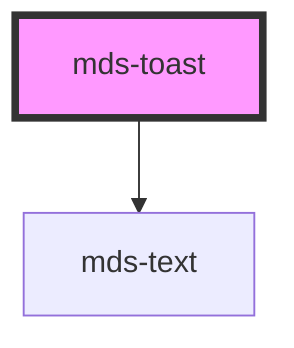

# mds-toast

This is a web-component from Maggioli Design System [Magma](https://magma.maggiolicloud.it), built with StencilJS, TypeScript, Storybook. It's based on the web-component standard and it's designed to be agnostic from the JavaScript framework you are using.

<!-- Auto Generated Below -->

## Usage

### 1. Description

The `<mds-toast>` web component is the transient notification surface of the Magma Design System, used to surface brief, non-blocking feedback messages that appear over the viewport and auto-dismiss after a timeout. It has no native HTML equivalent and orchestrates its own visibility, positioning, and auto-close lifecycle.

#### Semantic Behavior

- **Auto-dismiss timer**: When `visible` is true and `duration` is a positive number, an internal timer counts down and then sets `visible` back to `false`; setting `duration` to `0` (or falsy) keeps the toast on screen until it is closed intentionally.
- **Close event**: After the outro animation completes, the component emits `mdsToastClose` - consumers should listen for this to remove the toast from the DOM or update queue state.
- **Reactive timer**: Changing `visible` or `duration` at runtime restarts the timer, so toggling visibility re-arms the countdown rather than leaving a stale timer.
- **Conditional regions**: The text region renders only when the host has inner content, and the action region renders only when a `[slot="action"]` child is present - empty slots produce no layout.
- **Default-slot is text**: The default slot is intended for a plain text string only; icons go in the `icon` slot and interactive controls in the `action` slot.

#### Properties & Visual Configurations

The shared `variant` / `tone` ladders are defined in [`projects/stencil/SPEC.md`](../../../../SPEC.md#tone-and-variant-system); `<mds-toast>` consumes the theme variant set and the minimal tone set (`'strong'` / `'weak'`) without adding component-specific values.

#### Other behavioral props

- **`position`** anchors the toast to one of the six viewport corners/edges (top or bottom, left/center/right), driving both placement and the direction of the entry/exit animation; pick the edge that matches where users expect ephemeral feedback to surface.
- **`visible`** is the controlled on/off switch for the toast; toggling it drives the show/hide animation and the auto-dismiss timer rather than mounting or unmounting the element.
- **`duration`** is the visibility window in milliseconds before auto-dismiss; use a longer value for messages that carry an action the user must reach, and `0` for toasts that must stay until explicitly closed.

#### Slots

- **`icon`** holds a leading glyph (recommended `mds-icon`); **`action`** holds interactive follow-ups (recommended `mds-button`) and, when present, renders inside a dedicated actions container.

## Properties

| Property   | Attribute  | Description                                                                                                                                                                                                                                                   | Type                                                                                                 | Default           |
| ---------- | ---------- | ------------------------------------------------------------------------------------------------------------------------------------------------------------------------------------------------------------------------------------------------------------- | ---------------------------------------------------------------------------------------------------- | ----------------- |
| `duration` | `duration` | If set, specifies the visibility duration in milliseconds of the element inside the viewport, when the time is up the visible property will be set to false. If the duration is set to 0 the component will still visible until intentionally closed by user. | `number \| undefined`                                                                                | `5000`            |
| `position` | `position` | Sets position of toast                                                                                                                                                                                                                                        | `"bottom-center" \| "bottom-left" \| "bottom-right" \| "top-center" \| "top-left" \| "top-right"`    | `'bottom-center'` |
| `tone`     | `tone`     | Sets the tone of the color variant                                                                                                                                                                                                                            | `"strong" \| "weak" \| undefined`                                                                    | `'strong'`        |
| `variant`  | `variant`  | Sets the theme variant colours                                                                                                                                                                                                                                | `"ai" \| "dark" \| "error" \| "info" \| "light" \| "primary" \| "success" \| "warning" \| undefined` | `'light'`         |
| `visible`  | `visible`  | Specifies if toast is visible at the bottom or not                                                                                                                                                                                                            | `boolean \| undefined`                                                                               | `undefined`       |

## Events

| Event           | Description                        | Type                |
| --------------- | ---------------------------------- | ------------------- |
| `mdsToastClose` | Emits when the accordion is opened | `CustomEvent<void>` |

## Slots

| Slot        | Description                                                                                                       |
| ----------- | ----------------------------------------------------------------------------------------------------------------- |
| `"action"`  | Add `HTML elements` or `components`, it is **recommended** to use `mds-button` element.                           |
| `"default"` | Add `text string` to this slot, **avoid** to add `HTML elements` or `components` here.                            |
| `"icon"`    | Insert an icon image, it can be `HTML elements` or `components`, it is **recommended** to add `mds-icon` element. |

## CSS Custom Properties

| Name                     | Description                              |
| ------------------------ | ---------------------------------------- |
| `--mds-toast-background` | Background color of the toast component. |
| `--mds-toast-color`      | Text color inside the toast.             |
| `--mds-toast-duration`   | Duration of the toast display.           |
| `--mds-toast-icon-color` | Color of the icon inside the toast.      |
| `--mds-toast-shadow`     | Shadow applied to the toast container.   |
| `--mds-toast-width`      | Width of the toast component.            |

## Dependencies

### Depends on

- [mds-text](../mds-text)

### Graph

----------------------------------------------

Built with love @ [Gruppo Maggioli](https://www.maggioli.com) from [R&D Department](https://www.maggioli.com/it-it/chi-siamo/ricerca-sviluppo)
