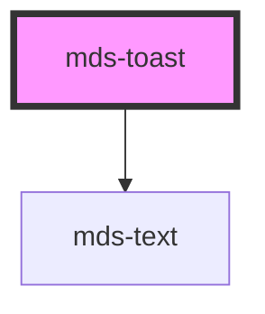

# mds-toast

<!-- Auto Generated Below -->

## Properties

| Property   | Attribute  | Description                                                                                                                                                  | Type                                                                                              | Default           |
| ---------- | ---------- | ------------------------------------------------------------------------------------------------------------------------------------------------------------ | ------------------------------------------------------------------------------------------------- | ----------------- |
| `duration` | `duration` | If set, specifies the visibility duration in milliseconds of the element inside the viewport, when the time is up the visible property will be set to false. | `number \| undefined`                                                                             | `5000`            |
| `position` | `position` | Sets position of toast                                                                                                                                       | `"bottom-center" \| "bottom-left" \| "bottom-right" \| "top-center" \| "top-left" \| "top-right"` | `'bottom-center'` |
| `tone`     | `tone`     | Sets the tone of the color variant                                                                                                                           | `"strong" \| "weak" \| undefined`                                                                 | `'strong'`        |
| `variant`  | `variant`  | Sets the theme variant colours                                                                                                                               | `"dark" \| "light" \| undefined`                                                                  | `'light'`         |
| `visible`  | `visible`  | Specifies if toast is visible at the bottom or not                                                                                                           | `boolean \| undefined`                                                                            | `undefined`       |

## Events

| Event           | Description                        | Type                |
| --------------- | ---------------------------------- | ------------------- |
| `mdsToastClose` | Emits when the accordion is opened | `CustomEvent<void>` |

## CSS Custom Properties

| Name                     | Description                                                                  |
| ------------------------ | ---------------------------------------------------------------------------- |
| `--mds-toast-background` | Sets the background-color of the component                                   |
| `--mds-toast-color`      | Sets the text color of the component                                         |
| `--mds-toast-duration`   | Sets the animation duration of the component, used also by component's logic |
| `--mds-toast-icon-color` | Sets the text color of the component                                         |
| `--mds-toast-shadow`     | Sets the box-shadow of the component                                         |

## Dependencies

### Depends on

- [mds-text](../mds-text)

### Graph

----------------------------------------------

Built with love @ **Maggioli Informatica / R&D Department**
