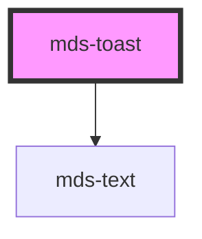

# mds-toast

This is a web-component from Maggioli Design System [Magma](https://magma.maggiolicloud.it), built with StencilJS, TypeScript, Storybook. It's based on the web-component standard and it's designed to be agnostic from the JavaScript framework you are using.

<!-- Auto Generated Below -->


## Usage

### 1. Description

The `<mds-toast>` web component is the transient notification surface of the Magma Design System, used to surface brief, non-blocking feedback messages that appear over the viewport and auto-dismiss after a timeout. It has no native HTML equivalent and orchestrates its own visibility, positioning, and auto-close lifecycle.

#### Semantic Behavior

- **Auto-dismiss timer**: When `visible` is true and `duration` is a positive number, an internal timer counts down and then sets `visible` back to `false`; setting `duration` to `0` (or falsy) keeps the toast on screen until it is closed intentionally.
- **Close event**: After the outro animation completes, the component emits `mdsToastClose` - consumers should listen for this to remove the toast from the DOM or update queue state.
- **Reactive timer**: Changing `visible` or `duration` at runtime restarts the timer, so toggling visibility re-arms the countdown rather than leaving a stale timer.
- **Conditional regions**: The text region renders only when the host has inner content, and the action region renders only when a `[slot="action"]` child is present - empty slots produce no layout.
- **Default-slot is text**: The default slot is intended for a plain text string only; icons go in the `icon` slot and interactive controls in the `action` slot.

#### Properties & Visual Configurations

The shared `variant` / `tone` ladders are defined in [`projects/stencil/SPEC.md`](../../../../SPEC.md#tone-and-variant-system); `<mds-toast>` consumes the theme variant set and the minimal tone set (`'strong'` / `'weak'`) without adding component-specific values.

#### Other behavioral props

- **`position`** anchors the toast to one of the six viewport corners/edges (top or bottom, left/center/right), driving both placement and the direction of the entry/exit animation; pick the edge that matches where users expect ephemeral feedback to surface.
- **`visible`** is the controlled on/off switch for the toast; toggling it drives the show/hide animation and the auto-dismiss timer rather than mounting or unmounting the element.
- **`duration`** is the visibility window in milliseconds before auto-dismiss; use a longer value for messages that carry an action the user must reach, and `0` for toasts that must stay until explicitly closed.

#### Slots

- **`icon`** holds a leading glyph (recommended `mds-icon`); **`action`** holds interactive follow-ups (recommended `mds-button`) and, when present, renders inside a dedicated actions container.


### 2. Pattern

Correct and idiomatic ways to use the `<mds-toast>` component, ordered from most common to most specialized. Patterns assume a working knowledge of the variant / tone ladders documented in [`docs/COMPONENTS.md`](../../../../../../docs/COMPONENTS.md) and the generic stencil rules in [`projects/stencil/SPEC.md`](../../../../SPEC.md).

#### Basic Text Toast

The simplest form. Set `visible` to show the toast; the default slot holds the message text only. The component auto-dismisses after the default 5000 ms.

```html
<mds-toast visible>
  Operazione completata con successo
</mds-toast>
```

#### Status Variants

Use `variant` to communicate the meaning of the feedback. The status family (`error`, `warning`, `info`, `success`) maps directly to the nature of the event. Do not pick a variant for its color alone.

```html
<!-- Conferma positiva -->
<mds-toast visible variant="success">
  Documento salvato correttamente
</mds-toast>

<!-- Errore bloccante -->
<mds-toast visible variant="error">
  Errore durante il salvataggio. Riprova.
</mds-toast>

<!-- Avviso non bloccante -->
<mds-toast visible variant="warning">
  La sessione scade tra 5 minuti
</mds-toast>

<!-- Informazione neutrale -->
<mds-toast visible variant="info">
  Aggiornamento disponibile
</mds-toast>
```

#### Tone for Emphasis

Pair `variant` with `tone` to adjust visual weight. `strong` (default) uses a saturated filled background; `weak` uses a lighter tint for lower emphasis.

```html
<!-- Forte enfasi: errore urgente -->
<mds-toast visible variant="error" tone="strong">
  Connessione persa
</mds-toast>

<!-- Enfasi ridotta: info secondaria -->
<mds-toast visible variant="info" tone="weak">
  Sincronizzazione in background
</mds-toast>
```

#### Toast with Icon

Use the `icon` slot with an `<mds-icon>` to add a leading glyph. The icon color inherits from `--mds-toast-icon-color` which is tuned per variant.

```html
<mds-toast visible variant="success">
  <mds-icon slot="icon" name="mi/baseline/check-circle"></mds-icon>
  File caricato con successo
</mds-toast>
```

#### Toast with Action

Use the `action` slot with an `<mds-button>` to offer a follow-up. The action region appears only when a `[slot="action"]` child is present - no empty layout is produced otherwise.

```html
<mds-toast visible variant="error">
  <mds-icon slot="icon" name="mi/baseline/error-outline"></mds-icon>
  Invio non riuscito
  <mds-button slot="action" size="sm" variant="error" tone="weak">
    Riprova
  </mds-button>
</mds-toast>
```

#### Persistent Toast (No Auto-Dismiss)

Set `duration="0"` to keep the toast visible until the user explicitly acts. Use this when the message carries an action the user must not miss.

```html
<mds-toast visible variant="warning" duration="0">
  <mds-icon slot="icon" name="mi/baseline/warning"></mds-icon>
  Sessione in scadenza
  <mds-button slot="action" size="sm" variant="warning" tone="weak">
    Rinnova
  </mds-button>
</mds-toast>
```

#### Custom Auto-Dismiss Duration

Override the 5000 ms default when the message needs more reading time (e.g. it carries an action) or can disappear faster (e.g. a trivial confirmation). Duration is in milliseconds.

```html
<!-- Messaggio breve: 2 secondi -->
<mds-toast visible variant="success" duration="2000">
  Copiato negli appunti
</mds-toast>

<!-- Con azione: 8 secondi -->
<mds-toast visible variant="info" duration="8000">
  Importazione completata con 3 avvisi
  <mds-button slot="action" size="sm" variant="info" tone="weak">
    Vedi report
  </mds-button>
</mds-toast>
```

#### Positioning

Use `position` to anchor the toast to one of the six viewport edges. Pick the edge that matches the application's layout convention - bottom-center is the default and works for most surfaces.

```html
<!-- Predefinito: centro in basso -->
<mds-toast visible variant="info" position="bottom-center">
  Messaggio salvato
</mds-toast>

<!-- Angolo in alto a destra (toolbar / panel) -->
<mds-toast visible variant="success" position="top-right">
  Impostazioni aggiornate
</mds-toast>
```

#### Listening for the Close Event

Listen for `mdsToastClose` to remove the toast from the DOM or update queue state after the outro animation completes. Do not react to `visible` becoming `false` directly - the animation is still running at that point.

```javascript
document.querySelector('mds-toast').addEventListener('mdsToastClose', () => {
  // rimuovi il toast dalla coda o aggiorna lo stato dell'applicazione
  toastQueue.shift();
});
```

#### Styling Customization

Style the toast only through its documented `--mds-toast-*` CSS custom properties. Set them on the host element or a parent selector; use Magma color tokens via `rgb(var(--<token>))` so dark mode and high-contrast modes keep working.

```css
.app-notifications mds-toast {
  --mds-toast-background: rgb(var(--tone-neutral-01));
  --mds-toast-color: rgb(var(--tone-neutral-10));
  --mds-toast-icon-color: rgb(var(--variant-primary-05));
  --mds-toast-width: 480px;
  --mds-toast-shadow: var(--shadow-xl);
}
```


### 3. Antipattern

Common incorrect uses of `<mds-toast>`. Each entry pairs the wrong form with the right one and a one-line reason. System-wide rules (boolean-as-string, shadow piercing, Tailwind color utilities, raw native event listening) live in [`docs/COMPONENTS.md`](../../../../../../docs/COMPONENTS.md#system-level-anti-patterns) - they apply here too but are not repeated.

#### Do Not Put HTML in the Default Slot

The default slot accepts plain text only; nested elements break the layout and may be stripped. Use the `icon` slot for an icon and the `action` slot for buttons.

```html
<!-- 🚫 INCORRECT -->
<mds-toast visible variant="error">
  <strong>Errore:</strong> salvataggio fallito
  <mds-button>Riprova</mds-button>
</mds-toast>

<!-- ✅ CORRECT -->
<mds-toast visible variant="error">
  <mds-icon slot="icon" name="mi/baseline/error-outline"></mds-icon>
  Salvataggio fallito
  <mds-button slot="action" size="sm" variant="error" tone="weak">Riprova</mds-button>
</mds-toast>
```

#### Do Not Set `duration="0"` to Mean "Use the Default"

Setting `duration="0"` explicitly disables auto-dismiss and keeps the toast on screen until the user closes it. To use the 5000 ms default, omit the attribute entirely.

```html
<!-- 🚫 INCORRECT - disables auto-dismiss unintentionally -->
<mds-toast visible variant="success" duration="0">
  Documento salvato
</mds-toast>

<!-- ✅ CORRECT - default 5000 ms applies -->
<mds-toast visible variant="success">
  Documento salvato
</mds-toast>
```

#### Do Not Use `visible="false"` to Hide the Toast

Setting a boolean attribute to the string `"false"` is truthy in HTML. Remove the attribute entirely (or set the prop to `undefined`) to hide the toast.

```html
<!-- 🚫 INCORRECT - the toast remains visible -->
<mds-toast visible="false" variant="info">
  Sincronizzazione in corso
</mds-toast>

<!-- ✅ CORRECT - attribute absent means hidden -->
<mds-toast variant="info">
  Sincronizzazione in corso
</mds-toast>
```

#### Do Not React to `visible` Becoming `false` to Clean Up

When the timer fires it sets `visible` to `false`, but the outro animation is still running. Listening to that attribute change too early removes the element mid-animation. Wait for `mdsToastClose`, which fires after the animation completes.

```javascript
// 🚫 INCORRECT - element may still be animating
const toast = document.querySelector('mds-toast');
const observer = new MutationObserver(() => {
  if (!toast.hasAttribute('visible')) {
    toast.remove();
  }
});
observer.observe(toast, { attributes: true });

// ✅ CORRECT - fires after the outro animation
toast.addEventListener('mdsToastClose', () => {
  toast.remove();
});
```

#### Do Not Use a Variant Without Checking Its Acceptance

`<mds-toast>` accepts `variant` values from `ThemeVariantType` but ships CSS overrides only for `light`, `dark`, `error`, `warning`, `info`, and `success`. Using `variant="primary"` or `variant="ai"` is valid by type but produces no themed color overrides - the toast falls back to the default light palette. Stick to the six documented status variants.

```html
<!-- 🚫 INCORRECT - no color override; looks identical to default -->
<mds-toast visible variant="primary">
  Azione confermata
</mds-toast>

<!-- ✅ CORRECT - uses a variant with full CSS support -->
<mds-toast visible variant="success">
  Azione confermata
</mds-toast>
```

#### Do Not Use `tone="outline"` or `tone="text"`

`<mds-toast>` uses `ToneMinimalVariantType`, which accepts only `strong` and `weak`. Passing `tone="outline"` or `tone="text"` silently falls back to the default and produces no visual difference.

```html
<!-- 🚫 INCORRECT - value not in ToneMinimalVariantType -->
<mds-toast visible variant="info" tone="outline">
  Aggiornamento disponibile
</mds-toast>

<!-- ✅ CORRECT -->
<mds-toast visible variant="info" tone="weak">
  Aggiornamento disponibile
</mds-toast>
```

#### Do Not Customize via Undocumented Shadow Parts or Internal Selectors

The supported surface is `--mds-toast-*` CSS custom properties. There are no documented `::part()` targets for `<mds-toast>`; targeting internal class names with `::part()`, `>>>`, or attribute-selector hacks couples your code to the shadow DOM implementation and will break on minor releases.

```css
/* 🚫 INCORRECT */
mds-toast >>> .dialog {
  border-radius: 0;
}

/* ✅ CORRECT - use the documented custom properties */
mds-toast {
  --mds-toast-background: rgb(var(--tone-neutral-01));
  --mds-toast-width: 360px;
}
```


## Properties

| Property   | Attribute  | Description                                                                                                                                                                                                                                                   | Type                                                                                                 | Default           |
| ---------- | ---------- | ------------------------------------------------------------------------------------------------------------------------------------------------------------------------------------------------------------------------------------------------------------- | ---------------------------------------------------------------------------------------------------- | ----------------- |
| `duration` | `duration` | If set, specifies the visibility duration in milliseconds of the element inside the viewport, when the time is up the visible property will be set to false. If the duration is set to 0 the component will still visible until intentionally closed by user. | `number \| undefined`                                                                                | `5000`            |
| `position` | `position` | Sets position of toast                                                                                                                                                                                                                                        | `"bottom-center" \| "bottom-left" \| "bottom-right" \| "top-center" \| "top-left" \| "top-right"`    | `'bottom-center'` |
| `tone`     | `tone`     | Sets the tone of the color variant                                                                                                                                                                                                                            | `"strong" \| "weak" \| undefined`                                                                    | `'strong'`        |
| `variant`  | `variant`  | Sets the theme variant colours                                                                                                                                                                                                                                | `"ai" \| "dark" \| "error" \| "info" \| "light" \| "primary" \| "success" \| "warning" \| undefined` | `'light'`         |
| `visible`  | `visible`  | Specifies if toast is visible at the bottom or not                                                                                                                                                                                                            | `boolean \| undefined`                                                                               | `undefined`       |


## Events

| Event           | Description                        | Type                |
| --------------- | ---------------------------------- | ------------------- |
| `mdsToastClose` | Emits when the accordion is opened | `CustomEvent<void>` |


## Slots

| Slot       | Description                                                                                                       |
| ---------- | ----------------------------------------------------------------------------------------------------------------- |
|            | Add `text string` to this slot, **avoid** to add `HTML elements` or `components` here.                            |
| `"action"` | Add `HTML elements` or `components`, it is **recommended** to use `mds-button` element.                           |
| `"icon"`   | Insert an icon image, it can be `HTML elements` or `components`, it is **recommended** to add `mds-icon` element. |


## CSS Custom Properties

| Name                     | Description                              |
| ------------------------ | ---------------------------------------- |
| `--mds-toast-background` | Background color of the toast component. |
| `--mds-toast-color`      | Text color inside the toast.             |
| `--mds-toast-duration`   | Duration of the toast display.           |
| `--mds-toast-icon-color` | Color of the icon inside the toast.      |
| `--mds-toast-shadow`     | Shadow applied to the toast container.   |
| `--mds-toast-width`      | Width of the toast component.            |


## Dependencies

### Depends on

- [mds-text](../mds-text)

### Graph


----------------------------------------------

Built with love @ [Gruppo Maggioli](https://www.maggioli.com) from [R&D Department](https://www.maggioli.com/it-it/chi-siamo/ricerca-sviluppo)
