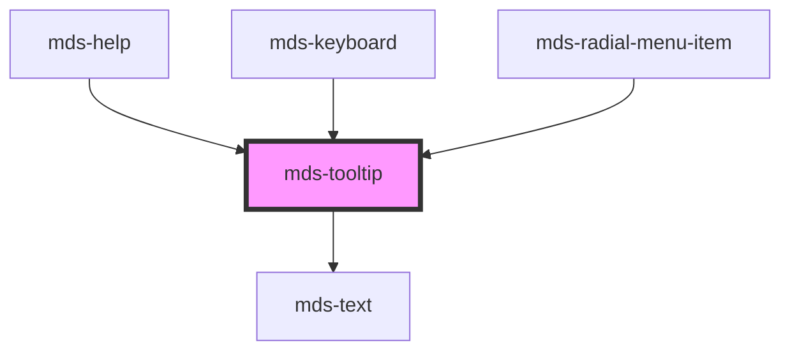

# mds-tooltip

### Version 4.0.0 breaking change

You can now use a query selector to taget a trigger element:

```html
<span class="trigger-element">Hello world</span>
<mds-tooltip target=".trigger-element"></mds-tooltip>
```

Up until version `3.x.x` you were forced to use an id selector:

```html
<span id="trigger-element">Hello world</span>
<mds-tooltip target="trigger-element"></mds-tooltip>
```

This is a web-component from Maggioli Design System [Magma](https://magma.maggiolicloud.it), built with StencilJS, TypeScript, Storybook. It's based on the web-component standard and it's designed to be agnostic from the JavaScript framework you are using.

<!-- Auto Generated Below -->


## Usage

### 1. Description

The `<mds-tooltip>` web component is the floating contextual hint of the Magma Design System. It renders a small text bubble that attaches to a separate trigger element identified by a CSS selector, rather than relying on the native `title` attribute.

#### Semantic Behavior

- **Detached trigger model**: The tooltip is not wrapped around its trigger; the required `target` selector is resolved and the component binds itself to the first matching caller.
- **Hover-driven visibility**: The bubble appears and disappears as the pointer enters and leaves the trigger.
- **Visibility is the source of truth**: Setting `visible` programmatically shows or dismisses the bubble, allowing the tooltip to be controlled without a hover.
- **Live repositioning**: Changing any layout prop (`placement`, `offset`, `shift`, `shiftPadding`, `strategy`, `flip`, `autoPlacement`, `arrow`) recomputes the floating position on the fly.
- **Text-only default slot**: The default slot is meant for a plain text string (exposed as the `text` shadow part); HTML elements or components should not be slotted in.

#### Properties & Visual Configurations

- **`target`** (required) is the CSS selector of the trigger element the tooltip listens to and anchors against; the first match wins.
- **`placement`** chooses the preferred side and alignment relative to the caller (e.g. `'top'`, `'bottom-start'`), while **`autoPlacement`** lets the system pick the best side automatically and **`flip`** allows falling back to the opposite side when the preferred one lacks space.
- **`shift`** keeps the bubble inside the viewport, with **`shiftPadding`** reserving a safe gap from the viewport edges; **`offset`** sets the distance between the bubble and the caller.
- **`strategy`** selects the CSS positioning strategy: `'fixed'` (default) escapes clipping ancestors, `'absolute'` anchors within the nearest positioned ancestor.
- **`typography`** picks the text scale of the bubble (`'tip'`, `'caption'`, `'detail'`), where `'tip'` is the default compact hint sizing.


## Properties

| Property              | Attribute        | Description                                                                                       | Type                                                                                                                                                                 | Default     |
| --------------------- | ---------------- | ------------------------------------------------------------------------------------------------- | -------------------------------------------------------------------------------------------------------------------------------------------------------------------- | ----------- |
| `autoPlacement`       | `auto-placement` | If set, the component will be placed automatically near it's caller.                              | `boolean`                                                                                                                                                            | `true`      |
| `flip`                | `flip`           | Specifies the placement of the component if no space is available where it is placed.             | `boolean`                                                                                                                                                            | `false`     |
| `offset`              | `offset`         | Sets distance between the tooltip and the caller.                                                 | `number`                                                                                                                                                             | `12`        |
| `placement`           | `placement`      | Specifies where the component should be placed relative to the caller.                            | `"bottom" \| "bottom-end" \| "bottom-start" \| "left" \| "left-end" \| "left-start" \| "right" \| "right-end" \| "right-start" \| "top" \| "top-end" \| "top-start"` | `'top'`     |
| `shift`               | `shift`          | If set, the component will be kept inside the viewport.                                           | `boolean`                                                                                                                                                            | `true`      |
| `shiftPadding`        | `shift-padding`  | Sets a safe area distance between the tooltip and the viewport.                                   | `number`                                                                                                                                                             | `12`        |
| `strategy`            | `strategy`       | Sets the CSS position strategy of the component.                                                  | `"absolute" \| "fixed"`                                                                                                                                              | `'fixed'`   |
| `target` _(required)_ | `target`         | Specifies the selector of the target element, this attribute is used with `querySelector` method. | `string`                                                                                                                                                             | `undefined` |
| `typography`          | `typography`     | Specifies the font typography of the element                                                      | `"caption" \| "detail" \| "tip"`                                                                                                                                     | `'tip'`     |
| `visible`             | `visible`        | Specifies the visibility of the component.                                                        | `boolean`                                                                                                                                                            | `false`     |


## Slots

| Slot        | Description                                                                            |
| ----------- | -------------------------------------------------------------------------------------- |
| `"default"` | Add `text string` to this slot, **avoid** to add `HTML elements` or `components` here. |


## Shadow Parts

| Part     | Description |
| -------- | ----------- |
| `"text"` |             |


## CSS Custom Properties

| Name                             | Description                                              |
| -------------------------------- | -------------------------------------------------------- |
| `--mds-tooltip-arrow-background` | Background color of the tooltip arrow.                   |
| `--mds-tooltip-background`       | Background color of the tooltip body.                    |
| `--mds-tooltip-delay`            | Delay before showing the tooltip.                        |
| `--mds-tooltip-dot-padding`      | Padding around the tooltip dot (if present).             |
| `--mds-tooltip-drop-shadow`      | Drop shadow applied to the tooltip.                      |
| `--mds-tooltip-duration`         | Duration of the tooltip animation.                       |
| `--mds-tooltip-ease`             | Timing function for the tooltip animation.               |
| `--mds-tooltip-transform-from`   | Transform applied at the start of the tooltip animation. |
| `--mds-tooltip-transform-to`     | Transform applied at the end of the tooltip animation.   |
| `--mds-tooltip-z-index`          | z-index of the tooltip container.                        |


## Dependencies

### Used by

 - [mds-help](../mds-help)
 - [mds-keyboard](../mds-keyboard)
 - [mds-radial-menu-item](../mds-radial-menu-item)

### Depends on

- [mds-text](../mds-text)

### Graph


----------------------------------------------

Built with love @ [Gruppo Maggioli](https://www.maggioli.com) from [R&D Department](https://www.maggioli.com/it-it/chi-siamo/ricerca-sviluppo)
