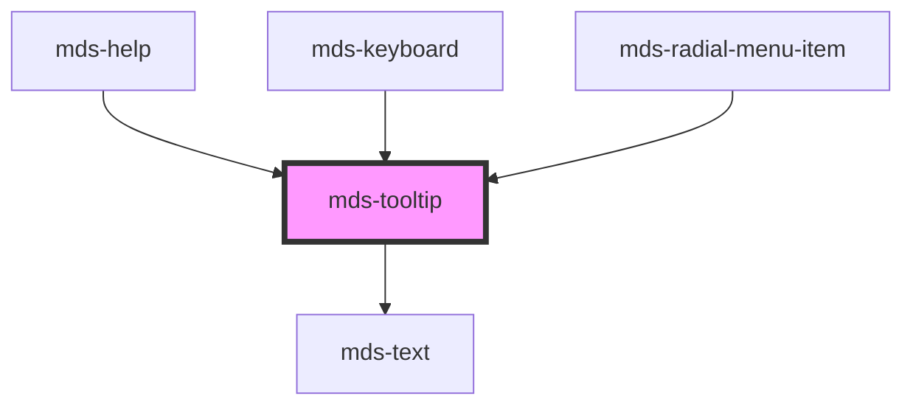

# mds-tooltip

### Version 4.0.0 breaking change

You can now use a query selector to taget a trigger element:

```html
<span class="trigger-element">Hello world</span>
<mds-tooltip target=".trigger-element"></mds-tooltip>
```

Up until version `3.x.x` you were forced to use an id selector:

```html
<span id="trigger-element">Hello world</span>
<mds-tooltip target="trigger-element"></mds-tooltip>
```

This is a web-component from Maggioli Design System [Magma](https://magma.maggiolicloud.it), built with StencilJS, TypeScript, Storybook. It's based on the web-component standard and it's designed to be agnostic from the JavaScript framework you are using.

<!-- Auto Generated Below -->


## Usage

### 1. Description

The `<mds-tooltip>` web component is the floating contextual hint of the Magma Design System. It renders a small text bubble that attaches to a separate trigger element identified by a CSS selector, rather than relying on the native `title` attribute.

#### Semantic Behavior

- **Detached trigger model**: The tooltip is not wrapped around its trigger; the required `target` selector is resolved and the component binds itself to the first matching caller.
- **Hover-driven visibility**: The bubble appears and disappears as the pointer enters and leaves the trigger.
- **Visibility is the source of truth**: Setting `visible` programmatically shows or dismisses the bubble, allowing the tooltip to be controlled without a hover.
- **Live repositioning**: Changing any layout prop (`placement`, `offset`, `shift`, `shiftPadding`, `strategy`, `flip`, `autoPlacement`, `arrow`) recomputes the floating position on the fly.
- **Text-only default slot**: The default slot is meant for a plain text string (exposed as the `text` shadow part); HTML elements or components should not be slotted in.

#### Properties & Visual Configurations

- **`target`** (required) is the CSS selector of the trigger element the tooltip listens to and anchors against; the first match wins.
- **`placement`** chooses the preferred side and alignment relative to the caller (e.g. `'top'`, `'bottom-start'`), while **`autoPlacement`** lets the system pick the best side automatically and **`flip`** allows falling back to the opposite side when the preferred one lacks space.
- **`shift`** keeps the bubble inside the viewport, with **`shiftPadding`** reserving a safe gap from the viewport edges; **`offset`** sets the distance between the bubble and the caller.
- **`strategy`** selects the CSS positioning strategy: `'fixed'` (default) escapes clipping ancestors, `'absolute'` anchors within the nearest positioned ancestor.
- **`typography`** picks the text scale of the bubble (`'tip'`, `'caption'`, `'detail'`), where `'tip'` is the default compact hint sizing.


### 2. Pattern

Correct and idiomatic ways to use the `<mds-tooltip>` component, ordered from most common to most specialized. Patterns assume a working knowledge of the generic stencil rules in [`projects/stencil/SPEC.md`](../../../../SPEC.md) and the component catalogue in [`docs/COMPONENTS.md`](../../../../../../docs/COMPONENTS.md).

#### Basic Tooltip on a Button

The most common form. Give the trigger element an `id` (or any unique CSS selector) and point `target` at it. The tooltip listens for hover events on the trigger and positions itself automatically.

```html
<mds-button id="salva-btn" label="Salva documento" variant="primary" tone="strong"></mds-button>
<mds-tooltip target="#salva-btn">Salva le modifiche correnti</mds-tooltip>
```

#### Tooltip on a Non-Interactive Element

`target` accepts any CSS selector, not just `#id`. Use a class or attribute selector when the trigger is a static element such as a status icon.

```html
<mds-icon class="stato-icona" name="mi/baseline/info"></mds-icon>
<mds-tooltip target=".stato-icona">Ultima sincronizzazione: oggi alle 08:30</mds-tooltip>
```

#### Placement and Preferred Side

Override the default `top` placement with `placement` when layout requires a different side. Set `auto-placement="false"` to lock the side and prevent the system from overriding it.

```html
<mds-button id="dettagli-btn" label="Dettagli" variant="secondary" tone="outline"></mds-button>
<mds-tooltip target="#dettagli-btn" placement="right" auto-placement="false">
  Apre il pannello laterale con i dettagli completi
</mds-tooltip>
```

Accepted values: `top`, `top-start`, `top-end`, `bottom`, `bottom-start`, `bottom-end`, `left`, `left-start`, `left-end`, `right`, `right-start`, `right-end`.

#### Flip Fallback When Space is Tight

Enable `flip` so the tooltip moves to the opposite side if the preferred placement collides with the viewport edge. Combine with `auto-placement="false"` to keep a preferred side while allowing a single-axis fallback.

```html
<mds-button id="azione-btn" label="Azione" variant="primary"></mds-button>
<mds-tooltip target="#azione-btn" placement="top" auto-placement="false" flip>
  Esegui l'operazione selezionata
</mds-tooltip>
```

#### Viewport-Safe Shift

`shift` (default `true`) slides the tooltip along its axis so it stays inside the viewport. Increase `shift-padding` to keep a wider safe margin from the viewport edges.

```html
<mds-button id="bordo-btn" label="Vicino al bordo" variant="dark" tone="outline"></mds-button>
<mds-tooltip target="#bordo-btn" shift shift-padding="24">
  Questa azione e' irreversibile
</mds-tooltip>
```

#### Custom Offset Distance

Increase `offset` when additional breathing room between the trigger and the bubble is required - for example inside dense toolbars or on elements with large focus rings.

```html
<mds-button id="info-btn" label="Info" variant="info" tone="weak"></mds-button>
<mds-tooltip target="#info-btn" offset="20">
  Informazioni aggiuntive sul campo
</mds-tooltip>
```

#### Programmatic Visibility

Set the `visible` attribute (or property) to control the tooltip without hover. Useful for guided tours, onboarding hints, or error annotations that appear on demand.

```html
<mds-button id="primo-accesso" label="Inizia" variant="primary"></mds-button>
<mds-tooltip id="hint" target="#primo-accesso" visible>
  Benvenuto! Clicca qui per iniziare la configurazione.
</mds-tooltip>

<script>
  const hint = document.querySelector('#hint');
  // Dismiss programmatically when the user acknowledges the hint
  document.querySelector('#primo-accesso').addEventListener('click', () => {
    hint.visible = false;
  });
</script>
```

#### Typography Scale

`typography` adjusts the text scale inside the bubble. Use `'tip'` (default) for compact hints, `'caption'` for slightly larger labels, and `'detail'` for the smallest footnote-style text.

```html
<!-- Default compact hint -->
<mds-tooltip target="#campo-nome" typography="tip">Massimo 64 caratteri</mds-tooltip>

<!-- Slightly larger label -->
<mds-tooltip target="#campo-data" typography="caption">Formato: GG/MM/AAAA</mds-tooltip>
```

#### Positioning Strategy

Use `strategy="absolute"` when the tooltip must be contained within a scrolling ancestor instead of the viewport. The default `strategy="fixed"` escapes any clipping or overflow-hidden parent.

```html
<!-- Inside a scrollable panel with overflow:hidden ancestors -->
<mds-tooltip target="#voce-lista" strategy="absolute">Trascina per riordinare</mds-tooltip>
```

#### Styling Customization

Style the tooltip only through its documented `--mds-tooltip-*` CSS custom properties. Set them on the host element or a parent selector; use the Magma color tokens via `rgb(var(--<token>))` so dark mode and high-contrast modes keep working.

```css
.onboarding-hint mds-tooltip {
  --mds-tooltip-background: rgb(var(--variant-primary-03));
  --mds-tooltip-arrow-background: rgb(var(--variant-primary-03));
  --mds-tooltip-delay: 0.25s;
  --mds-tooltip-duration: 0.3s;
  --mds-tooltip-z-index: 5000;
}
```


### 3. Antipattern

Common incorrect uses of `<mds-tooltip>`. Each entry pairs the wrong form with the right one and a one-line reason. System-wide rules (boolean-as-string, shadow piercing, Tailwind color utilities, raw native event listening) live in [`docs/COMPONENTS.md`](../../../../../../docs/COMPONENTS.md#system-level-anti-patterns) - they apply here too but are not repeated.

#### Do Not Use a Bare ID String as `target`

Before Magma 4.0 the `target` attribute accepted a bare id without the `#` prefix. This is no longer valid; the value is now passed directly to `querySelector`, so a CSS selector is required.

```html
<!-- 🚫 INCORRECT (Magma 3.x style) -->
<span id="hint-trigger">Aiuto</span>
<mds-tooltip target="hint-trigger">Testo di aiuto</mds-tooltip>

<!-- ✅ CORRECT (Magma 4.x querySelector selector) -->
<span id="hint-trigger">Aiuto</span>
<mds-tooltip target="#hint-trigger">Testo di aiuto</mds-tooltip>
```

#### Do Not Slot HTML Elements or Components

The default slot is text-only. Nesting HTML elements or Magma components breaks the inner layout and may produce unexpected rendering because the slot is wrapped in `<mds-text>`.

```html
<!-- 🚫 INCORRECT -->
<mds-tooltip target="#voce">
  <mds-icon name="mi/baseline/warning"></mds-icon>
  <strong>Attenzione:</strong> campo obbligatorio
</mds-tooltip>

<!-- ✅ CORRECT -->
<mds-tooltip target="#voce">Attenzione: campo obbligatorio</mds-tooltip>
```

#### Do Not Wrap the Trigger Inside the Tooltip

`<mds-tooltip>` uses a detached trigger model - the tooltip is placed as a sibling in the DOM and linked via `target`, not wrapped around its trigger. Nesting the trigger breaks the floating position logic.

```html
<!-- 🚫 INCORRECT -->
<mds-tooltip target="#btn">
  <mds-button id="btn" label="Elimina"></mds-button>
  Elimina il record selezionato
</mds-tooltip>

<!-- ✅ CORRECT -->
<mds-button id="btn" label="Elimina" variant="error" tone="text"></mds-button>
<mds-tooltip target="#btn">Elimina il record selezionato</mds-tooltip>
```

#### Do Not Set `visible="false"` to Hide the Tooltip

`visible` is a boolean attribute; setting it to the string `"false"` is truthy in HTML and keeps the tooltip visible. Remove the attribute (or set the property to `false`) to hide it.

```html
<!-- 🚫 INCORRECT -->
<mds-tooltip target="#campo" visible="false">Testo nascosto</mds-tooltip>

<!-- ✅ CORRECT -->
<mds-tooltip target="#campo">Testo nascosto</mds-tooltip>
```

```js
// ✅ CORRECT (programmatic)
document.querySelector('mds-tooltip').visible = false;
```

#### Do Not Pierce the Shadow DOM to Style Internal Parts

The only supported customization surface is the set of `--mds-tooltip-*` CSS custom properties and the documented `text` shadow part. Targeting undocumented internal selectors couples your code to the implementation and will break on minor releases.

```css
/* 🚫 INCORRECT */
mds-tooltip >>> .text {
  font-style: italic;
}
mds-tooltip::part(arrow) {
  fill: red;
}

/* ✅ CORRECT */
mds-tooltip {
  --mds-tooltip-background: rgb(var(--variant-primary-03));
  --mds-tooltip-delay: 0.5s;
}
mds-tooltip::part(text) {
  font-style: italic;
}
```

#### Do Not Replace `<mds-tooltip>` with a Native `title` Attribute

The native `title` tooltip is not keyboard-accessible, not styleable, and not announced consistently by screen readers on touch devices. Use `<mds-tooltip>` for all contextual hints.

```html
<!-- 🚫 INCORRECT -->
<mds-button label="Elimina" title="Elimina il record selezionato"></mds-button>

<!-- ✅ CORRECT -->
<mds-button id="elimina-btn" label="Elimina" variant="error" tone="text"></mds-button>
<mds-tooltip target="#elimina-btn">Elimina il record selezionato</mds-tooltip>
```


## Properties

| Property              | Attribute        | Description                                                                                       | Type                                                                                                                                                                 | Default     |
| --------------------- | ---------------- | ------------------------------------------------------------------------------------------------- | -------------------------------------------------------------------------------------------------------------------------------------------------------------------- | ----------- |
| `autoPlacement`       | `auto-placement` | If set, the component will be placed automatically near it's caller.                              | `boolean`                                                                                                                                                            | `true`      |
| `flip`                | `flip`           | Specifies the placement of the component if no space is available where it is placed.             | `boolean`                                                                                                                                                            | `false`     |
| `offset`              | `offset`         | Sets distance between the tooltip and the caller.                                                 | `number`                                                                                                                                                             | `12`        |
| `placement`           | `placement`      | Specifies where the component should be placed relative to the caller.                            | `"bottom" \| "bottom-end" \| "bottom-start" \| "left" \| "left-end" \| "left-start" \| "right" \| "right-end" \| "right-start" \| "top" \| "top-end" \| "top-start"` | `'top'`     |
| `shift`               | `shift`          | If set, the component will be kept inside the viewport.                                           | `boolean`                                                                                                                                                            | `true`      |
| `shiftPadding`        | `shift-padding`  | Sets a safe area distance between the tooltip and the viewport.                                   | `number`                                                                                                                                                             | `12`        |
| `strategy`            | `strategy`       | Sets the CSS position strategy of the component.                                                  | `"absolute" \| "fixed"`                                                                                                                                              | `'fixed'`   |
| `target` _(required)_ | `target`         | Specifies the selector of the target element, this attribute is used with `querySelector` method. | `string`                                                                                                                                                             | `undefined` |
| `typography`          | `typography`     | Specifies the font typography of the element                                                      | `"caption" \| "detail" \| "tip"`                                                                                                                                     | `'tip'`     |
| `visible`             | `visible`        | Specifies the visibility of the component.                                                        | `boolean`                                                                                                                                                            | `false`     |


## Slots

| Slot | Description                                                                            |
| ---- | -------------------------------------------------------------------------------------- |
|      | Add `text string` to this slot, **avoid** to add `HTML elements` or `components` here. |


## Shadow Parts

| Part     | Description |
| -------- | ----------- |
| `"text"` |             |


## CSS Custom Properties

| Name                             | Description                                              |
| -------------------------------- | -------------------------------------------------------- |
| `--mds-tooltip-arrow-background` | Background color of the tooltip arrow.                   |
| `--mds-tooltip-background`       | Background color of the tooltip body.                    |
| `--mds-tooltip-delay`            | Delay before showing the tooltip.                        |
| `--mds-tooltip-dot-padding`      | Padding around the tooltip dot (if present).             |
| `--mds-tooltip-drop-shadow`      | Drop shadow applied to the tooltip.                      |
| `--mds-tooltip-duration`         | Duration of the tooltip animation.                       |
| `--mds-tooltip-ease`             | Timing function for the tooltip animation.               |
| `--mds-tooltip-transform-from`   | Transform applied at the start of the tooltip animation. |
| `--mds-tooltip-transform-to`     | Transform applied at the end of the tooltip animation.   |
| `--mds-tooltip-z-index`          | z-index of the tooltip container.                        |


## Dependencies

### Used by

 - [mds-help](../mds-help)
 - [mds-keyboard](../mds-keyboard)
 - [mds-radial-menu-item](../mds-radial-menu-item)

### Depends on

- [mds-text](../mds-text)

### Graph


----------------------------------------------

Built with love @ [Gruppo Maggioli](https://www.maggioli.com) from [R&D Department](https://www.maggioli.com/it-it/chi-siamo/ricerca-sviluppo)
