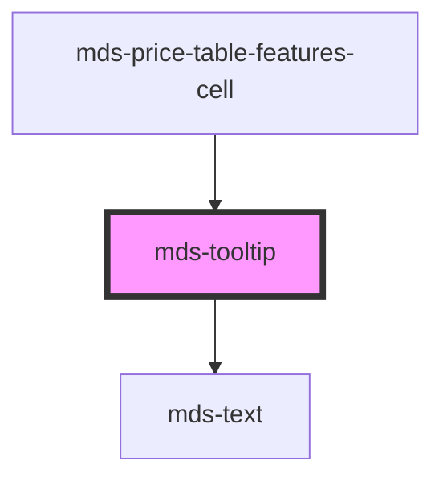

# mds-tooltip

<!-- Auto Generated Below -->

## Properties

| Property              | Attribute        | Description                                                                           | Type                                                                                                                                                                              | Default     |
| --------------------- | ---------------- | ------------------------------------------------------------------------------------- | --------------------------------------------------------------------------------------------------------------------------------------------------------------------------------- | ----------- |
| `arrow`               | `arrow`          | If set, the component will have an arrow pointing to the caller.                      | `boolean \| undefined`                                                                                                                                                            | `true`      |
| `autoPlacement`       | `auto-placement` | If set, the component will be placed automatically near it's caller.                  | `boolean \| undefined`                                                                                                                                                            | `true`      |
| `flip`                | `flip`           | Specifies the placement of the component if no space is available where it is placed. | `boolean`                                                                                                                                                                         | `false`     |
| `offset`              | `offset`         | Sets distance between the tooltip and the caller.                                     | `number`                                                                                                                                                                          | `12`        |
| `placement`           | `placement`      | Specifies where the component should be placed relative to the caller.                | `"bottom" \| "bottom-end" \| "bottom-start" \| "left" \| "left-end" \| "left-start" \| "right" \| "right-end" \| "right-start" \| "top" \| "top-end" \| "top-start" \| undefined` | `'top'`     |
| `shift`               | `shift`          | If set, the component will be kept inside the viewport.                               | `boolean \| undefined`                                                                                                                                                            | `true`      |
| `shiftPadding`        | `shift-padding`  | Sets a safe area distance between the tooltip and the viewport.                       | `number`                                                                                                                                                                          | `12`        |
| `strategy`            | `strategy`       | Sets the CSS position strategy of the component.                                      | `"absolute" \| "fixed" \| undefined`                                                                                                                                              | `'fixed'`   |
| `target` _(required)_ | `target`         | Specifies the id of the caller element.                                               | `string`                                                                                                                                                                          | `undefined` |
| `typography`          | `typography`     | Specifies the font typography of the element                                          | `"caption" \| "detail" \| "tip"`                                                                                                                                                  | `'tip'`     |
| `visible`             | `visible`        | Specifies the visibility of the component.                                            | `boolean`                                                                                                                                                                         | `false`     |

## Slots

| Slot        | Description                                                                            |
| ----------- | -------------------------------------------------------------------------------------- |
| `"default"` | Add `text string` to this slot, **avoid** to add `HTML elements` or `components` here. |

## CSS Custom Properties

| Name                             | Description                                       |
| -------------------------------- | ------------------------------------------------- |
| `--mds-tooltip-arrow-background` | Sets the fill color of the arrow.                 |
| `--mds-tooltip-background`       | Sets the background-color of the tooltip.         |
| `--mds-tooltip-delay`            | Sets the delay of the tooltip.                    |
| `--mds-tooltip-drop-shadow`      | Sets the drop-shadow of the tooltip.              |
| `--mds-tooltip-duration`         | Sets the duration of the tooltip animation.       |
| `--mds-tooltip-ease`             | Sets the easing of the tooltip animation.         |
| `--mds-tooltip-transform-from`   | Sets the from animation transform of the tooltip. |
| `--mds-tooltip-transform-to`     | Sets the to animation transform of the tooltip.   |
| `--mds-tooltip-z-index`          | Sets the z-index of the component.                |

## Dependencies

### Used by

 - [mds-price-table-features-cell](../mds-price-table-features-cell)

### Depends on

- [mds-text](../mds-text)

### Graph

----------------------------------------------

Built with love @ **Maggioli Informatica / R&D Department**
