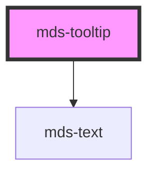

# mds-tooltip

<!-- Auto Generated Below -->

## Properties

| Property           | Attribute  | Description                                                           | Type                                     | Default     |
| ------------------ | ---------- | --------------------------------------------------------------------- | ---------------------------------------- | ----------- |
| `delay`            | `delay`    | Specifies the delay when the tooltip will trigger                     | `number`                                 | `1000`      |
| `for` _(required)_ | `for`      | Specifies the id selector of the element will trigger the tooltip     | `string`                                 | `undefined` |
| `position`         | `position` | Specifies the position of the tooltip relative to the trigger element | `"bottom" \| "left" \| "right" \| "top"` | `'top'`     |
| `variant`          | `variant`  | Specifies the color variant for the element                           | `"dark" \| "light"`                      | `'dark'`    |

## CSS Custom Properties

| Name                 | Description                                                                  |
| -------------------- | ---------------------------------------------------------------------------- |
| `--arrow-size`       | Specifies the size of the arrow decoration                                   |
| `--background`       | Specifies the background-color of the component                              |
| `--color`            | Specifies the text color of the component                                    |
| `--drop-shadow`      | Specifies the drop-shadow filter of the component (not box-shadow)           |
| `--max-width`        | Specifies the max-width of the component                                     |
| `--transition-intro` | Specifies the transition animation effect of the component when is triggered |
| `--transition-outro` | Specifies the transition animation effect of the component when is closed    |

## Dependencies

### Depends on

- [mds-text](../mds-text)

### Graph

----------------------------------------------

Built with love @ **Maggioli Informatica / R&D Department**
