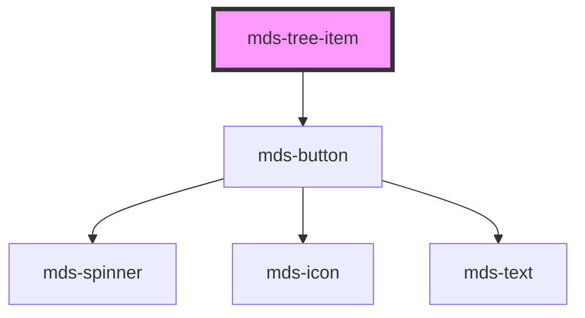

# mds-tree-item

<!-- Auto Generated Below -->

## Properties

| Property   | Attribute  | Description                                                              | Type                                     | Default     |
| ---------- | ---------- | ------------------------------------------------------------------------ | ---------------------------------------- | ----------- |
| `actions`  | `actions`  | Show actions on the tree item on hover or by default.                    | `"auto" \| "visible" \| undefined`       | `undefined` |
| `async`    | `async`    | Specifies the tree should be opened asynchronously when after the click. | `boolean \| undefined`                   | `undefined` |
| `depth`    | `depth`    |                                                                          | `number \| undefined`                    | `undefined` |
| `expanded` | `expanded` | Specifies if the tree is expanded.                                       | `boolean \| undefined`                   | `undefined` |
| `icon`     | `icon`     | The icon displayed in the button                                         | `string \| undefined`                    | `undefined` |
| `label`    | `label`    | Specifies the label of the tree item                                     | `string`                                 | `undefined` |
| `toggle`   | `toggle`   | Specifies the icon of the element                                        | `"chevron" \| "folder" \| undefined`     | `undefined` |
| `truncate` | `truncate` | Truncate the text of the element on one single line.                     | `"all" \| "none" \| "word" \| undefined` | `'word'`    |

## Events

| Event                 | Description                                             | Type                                  |
| --------------------- | ------------------------------------------------------- | ------------------------------------- |
| `mdsTreeItemCollapse` | Emits when the component attribute selected is changed  | `CustomEvent<MdsTreeItemEventDetail>` |
| `mdsTreeItemExpand`   | Emits when the component expand it's children container | `CustomEvent<MdsTreeItemEventDetail>` |

## Methods

### `expand() => Promise<void>`

#### Returns

Type: `Promise<void>`

### `updateLang() => Promise<void>`

#### Returns

Type: `Promise<void>`

## Slots

| Slot        | Description                                                               |
| ----------- | ------------------------------------------------------------------------- |
| `"action"`  | Add `mds-button`, `mds-icon` or other types component and HTML element/s. |
| `"default"` | Add `mds-tree-item` element/s.                                            |

## Shadow Parts

| Part                  | Description                                          |
| --------------------- | ---------------------------------------------------- |
| `"actions-container"` | Selects the wrapper of the container of the actions. |
| `"actions-list"`      | Selects the container of the actions.                |

## Dependencies

### Depends on

- [mds-button](../mds-button)

### Graph

----------------------------------------------

Built with love @ [Gruppo Maggioli](https://www.maggioli.com) from [R&D Department](https://www.maggioli.com/it-it/chi-siamo/ricerca-sviluppo)
