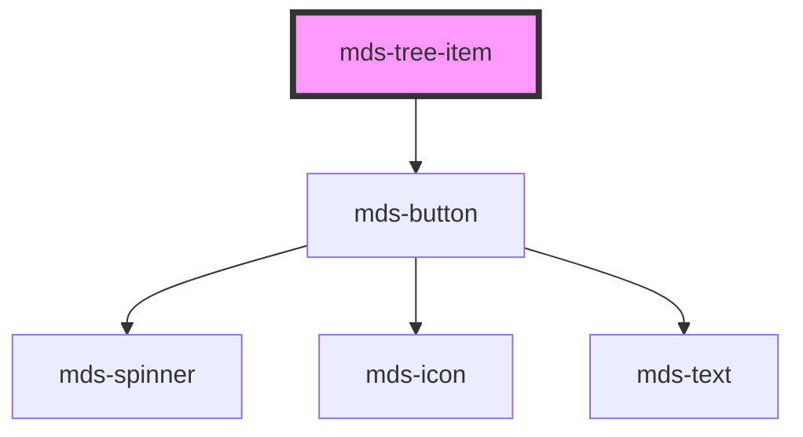

# mds-tree-item

<!-- Auto Generated Below -->

## Properties

| Property   | Attribute  | Description                                                                                       | Type                                     | Default     |
| ---------- | ---------- | ------------------------------------------------------------------------------------------------- | ---------------------------------------- | ----------- |
| `async`    | `async`    | Specifies the tree should be opened asynchronously when after the click, .                        | `boolean \| undefined`                   | `undefined` |
| `expanded` | `expanded` | Specifies if the tree is expanded.                                                                | `boolean \| undefined`                   | `undefined` |
| `icon`     | `icon`     | The icon displayed in the button                                                                  | `string \| undefined`                    | `undefined` |
| `label`    | `label`    | Specifies the selector of the target element, this attribute is used with `querySelector` method. | `string`                                 | `undefined` |
| `toggle`   | `toggle`   | Specifies the icon of the element                                                                 | `"chevron" \| "folder" \| undefined`     | `undefined` |
| `truncate` | `truncate` | Truncate the text of the element on one single line.                                              | `"all" \| "none" \| "word" \| undefined` | `'word'`    |

## Methods

### `open() => Promise<void>`

#### Returns

Type: `Promise<void>`

### `updateLang() => Promise<void>`

#### Returns

Type: `Promise<void>`

## Shadow Parts

| Part        | Description |
| ----------- | ----------- |
| `"actions"` |             |

## Dependencies

### Depends on

- [mds-button](../mds-button)

### Graph

----------------------------------------------

Built with love @ [Gruppo Maggioli](https://www.maggioli.com) from [R&D Department](https://www.maggioli.com/it-it/chi-siamo/ricerca-sviluppo)
