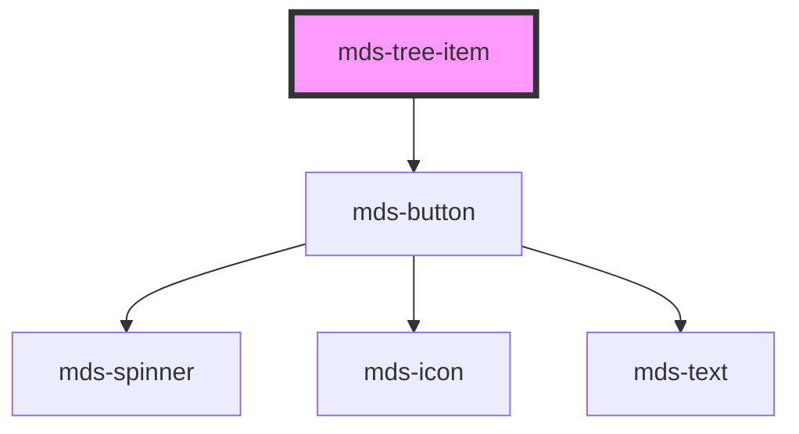

# mds-tree-item


<!-- Auto Generated Below -->


## Usage

### 1. Description

The `<mds-tree-item>` web component is the node primitive of the Magma Design System tree view: it represents a single labeled, expandable/collapsible entry inside an [`<mds-tree>`](../../mds-tree) and is also the recursive container for its own descendants. It replaces the role of an `<li>` within a nested disclosure list.

#### Semantic Behavior

- **Compound child only**: It must be a direct slot child of `<mds-tree>` (first-level nodes) or of another `<mds-tree-item>` (nested nodes). It is not used standalone, and the default slot is reserved for further `<mds-tree-item>` children - not arbitrary content.
- **Parent-driven defaults**: The parent `<mds-tree>` writes `toggle`, `truncate`, `actions`, `depth` and `expanded` onto its descendant items, so these props are usually orchestrated by the tree rather than set per-item. First-level items receive `depth = 0`.
- **Self-managed expansion**: Clicking the toggle or label flips `expanded`, swaps the toggle icon, and animates the children container; on collapse it emits `mdsTreeItemCollapse`.
- **Asynchronous expansion**: When `async` is set, the first expand click does not open immediately - it shows a spinner and emits `mdsTreeItemExpand` so the host can lazy-load children, then calls the public `expand()` method to finalize opening.
- **Bubbled events**: `mdsTreeItemExpand` and `mdsTreeItemCollapse` both carry `{ element }` (the host item) so the tree or application can react to node lifecycle.
- **Leaf vs. branch**: It detects whether it contains nested items and whether it has slotted actions, adjusting the connector/branch rendering and actions visibility accordingly.
- **Public method**: `expand()` opens the node and clears the awaiting state (used to resolve async loads).

#### Properties & Visual Configurations

- **`toggle`**: Picks the disclosure affordance - `chevron` (default arrow) or `folder` (closed/open folder icons that swap with `expanded`). Normally inherited from the parent tree for visual consistency.
- **`actions`**: Controls when slotted `action` controls appear - `auto` reveals them on hover, `visible` keeps them always shown. Place those controls in the named `action` slot.
- **`async`**: Enable when a node's children are loaded on demand; pair it with a listener on `mdsTreeItemExpand` and a call to `expand()` once data is ready.
- **`expanded`**: Mutable open/closed state; set it directly to pre-open a node, but expect the parent tree to override it when the whole tree expands or collapses.
- **`truncate`**: Governs label overflow (`word`, `all`, `none`); `all` enables multi-line clamping. Usually inherited from the tree.
- **`icon`**: Optional leading icon rendered inside the label button, independent of the toggle affordance.
- **`depth`**: Internal/parent-assigned; drives branch-line decoration and should not normally be set by consumers.


### 2. Pattern

Correct and idiomatic ways to use the `<mds-tree-item>` component, ordered from most common to most specialized. Patterns assume a working knowledge of the compound parent [`<mds-tree>`](../../mds-tree) and the generic stencil rules in [`projects/stencil/SPEC.md`](../../../../SPEC.md).

#### Basic Node Inside a Tree

The minimal form: a labeled item nested inside its parent `<mds-tree>`. The tree orchestrates `toggle`, `truncate`, and `actions` for all descendants, so you rarely need to set them per item.

```html
<mds-tree>
  <mds-tree-item label="Documenti"></mds-tree-item>
  <mds-tree-item label="Immagini"></mds-tree-item>
  <mds-tree-item label="Video"></mds-tree-item>
</mds-tree>
```

#### Nested Hierarchy

Place `<mds-tree-item>` elements in the default slot of another `<mds-tree-item>` to build a hierarchy. The component detects nested children automatically and renders the branch connector.

```html
<mds-tree>
  <mds-tree-item label="Ufficio Tecnico">
    <mds-tree-item label="Pratiche edilizie">
      <mds-tree-item label="Domanda 2024-001"></mds-tree-item>
      <mds-tree-item label="Domanda 2024-002"></mds-tree-item>
    </mds-tree-item>
    <mds-tree-item label="Concessioni"></mds-tree-item>
  </mds-tree-item>
  <mds-tree-item label="Ragioneria"></mds-tree-item>
</mds-tree>
```

#### Pre-Opened Node

Set `expanded` to open a node on first render. Useful for landing pages where a specific branch should already be visible.

```html
<mds-tree>
  <mds-tree-item label="Pratiche in corso" expanded>
    <mds-tree-item label="Richiesta #1042"></mds-tree-item>
    <mds-tree-item label="Richiesta #1043"></mds-tree-item>
  </mds-tree-item>
  <mds-tree-item label="Archivio"></mds-tree-item>
</mds-tree>
```

#### Node with a Leading Icon

Use the `icon` prop to add an icon before the label text. Reference icons by their slug - no `.svg` extension. The icon is independent of the toggle affordance.

```html
<mds-tree>
  <mds-tree-item label="Segreteria" icon="mi/baseline/desk">
    <mds-tree-item label="Genoveffo Baci" icon="mi/baseline/person"></mds-tree-item>
    <mds-tree-item label="Donaldo Trombetta" icon="mi/baseline/person"></mds-tree-item>
  </mds-tree-item>
  <mds-tree-item label="Archivio" icon="mi/baseline/archive"></mds-tree-item>
</mds-tree>
```

#### Folder Toggle Style

When the tree uses `toggle="folder"`, each item swaps between a closed-folder and open-folder icon as it expands. Set `toggle` on the parent `<mds-tree>` and all items inherit it automatically; only set it per item when you need mixed icon styles.

```html
<mds-tree toggle="folder">
  <mds-tree-item label="Modulistica">
    <mds-tree-item label="Modulo A"></mds-tree-item>
    <mds-tree-item label="Modulo B"></mds-tree-item>
  </mds-tree-item>
</mds-tree>
```

#### Per-Item Action Controls

Slot `<mds-button>` or `<mds-icon>` elements into the `action` slot to attach contextual controls to a node. Use the `actions` prop (inherited from the tree) to choose when they appear: `"auto"` shows them on hover, `"visible"` keeps them always visible.

```html
<mds-tree actions="auto">
  <mds-tree-item label="Contratto 2024">
    <mds-button
      slot="action"
      icon="mi/baseline/attach-file"
      variant="primary"
      tone="text"
      title="Allega documento"
    ></mds-button>
    <mds-button
      slot="action"
      icon="mi/baseline/more-vert"
      variant="primary"
      tone="text"
      title="Altre opzioni"
    ></mds-button>
    <mds-tree-item label="Allegato 1"></mds-tree-item>
  </mds-tree-item>
</mds-tree>
```

#### Asynchronous (Lazy-Load) Node

Set `async` on a node when its children must be fetched on demand. On first expand the item shows a spinner and emits `mdsTreeItemExpand`; call `expand()` on the element once data is ready to finalize opening. After resolving, set `async` to `undefined` (or remove the attribute) so subsequent toggles work synchronously.

```html
<mds-tree>
  <mds-tree-item async label="Dipendenti" icon="mi/baseline/group" id="dept-node">
    <!-- children injected after fetch -->
  </mds-tree-item>
</mds-tree>

<script>
  document.getElementById('dept-node').addEventListener(
    'mdsTreeItemExpand',
    async (event) => {
      const node = event.detail.element;
      if (!node.async) return;
      const people = await fetchDepartmentPeople();
      people.forEach((name) => {
        const item = document.createElement('mds-tree-item');
        item.label = name;
        item.icon = 'mi/baseline/person';
        node.appendChild(item);
      });
      await node.expand();
      node.async = undefined;
    },
  );
</script>
```

#### Reacting to Expand and Collapse Events

Listen to `mdsTreeItemExpand` and `mdsTreeItemCollapse` to keep external state (e.g. a sidebar breadcrumb or a selection store) in sync. Both events carry `{ element }` - the host `<mds-tree-item>` - so you can read its `label` or any other prop.

```html
<mds-tree id="struttura-tree">
  <mds-tree-item label="Ufficio A">
    <mds-tree-item label="Sezione 1"></mds-tree-item>
  </mds-tree-item>
</mds-tree>

<script>
  document.getElementById('struttura-tree').addEventListener('mdsTreeItemExpand', (event) => {
    console.log('Espanso:', event.detail.element.label);
  });
  document.getElementById('struttura-tree').addEventListener('mdsTreeItemCollapse', (event) => {
    console.log('Compresso:', event.detail.element.label);
  });
</script>
```

#### Multi-Line Label with Clamping

Set `truncate="all"` on the tree (or the item) to allow multi-line text with clamping controlled by `--mds-tree-item-line-clamp`. Use this for long file paths or descriptive labels.

```html
<mds-tree truncate="all">
  <mds-tree-item label="Delibera di Giunta Comunale n. 42 del 15 marzo 2024 - approvazione bilancio">
  </mds-tree-item>
  <mds-tree-item label="Verbale seduta straordinaria del Consiglio Comunale del 22 aprile 2024">
  </mds-tree-item>
</mds-tree>
```

#### CSS Customization

Customize the item's appearance only through its documented `--mds-tree-item-*` CSS custom properties. Set them on the host or a parent selector; use Magma color tokens via `rgb(var(--<token>))` to stay compatible with dark mode and high-contrast.

```css
.archivio-tree mds-tree-item {
  --mds-tree-item-branch-border-color: rgb(var(--variant-primary-03));
  --mds-tree-item-branch-dot-expanded-color: rgb(var(--variant-primary-05));
  --mds-tree-item-label-hover-background: rgb(var(--tone-kaolin-02));
  --mds-tree-item-toggle-icon-chevron-default-color: rgb(var(--variant-primary-04));
  --mds-tree-item-transition-duration: 200ms;
}
```

#### Styling the Actions Container via Shadow Parts

Use `::part(actions-container)` and `::part(actions-list)` to style the wrapper and inner list of action controls when the CSS custom properties are not sufficient. This is the documented exception - do not target other internal parts.

```css
mds-tree-item::part(actions-container) {
  background: rgb(var(--tone-kaolin-01));
  border-radius: var(--radius-md);
}

mds-tree-item::part(actions-list) {
  gap: var(--spacing-200);
}
```


### 3. Antipattern

Common incorrect uses of `<mds-tree-item>`. Each entry pairs the wrong form with the right one and a one-line reason. System-wide rules (boolean-as-string, shadow piercing, Tailwind color utilities, raw native event listening) live in [`docs/COMPONENTS.md`](../../../../../../docs/COMPONENTS.md#system-level-anti-patterns) - they apply here too but are not repeated.

#### Do Not Use the Default Slot for Arbitrary Content

The default slot accepts only `<mds-tree-item>` children. Slotting arbitrary HTML (text, icons, buttons) into the default slot does not produce a label or a nested item - use the `label` prop for text and the `action` slot for action controls.

```html
<!-- 🚫 INCORRECT -->
<mds-tree-item>
  <span>Documenti</span>
  <mds-button icon="mi/baseline/add"></mds-button>
</mds-tree-item>

<!-- ✅ CORRECT -->
<mds-tree-item label="Documenti">
  <mds-button
    slot="action"
    icon="mi/baseline/add"
    title="Aggiungi documento"
    variant="primary"
    tone="text"
  ></mds-button>
</mds-tree-item>
```

#### Do Not Use the `action` Slot for Child Nodes

The `action` slot is for contextual controls (buttons, icons). Putting a `<mds-tree-item>` in the `action` slot removes it from the expand/collapse tree hierarchy and breaks branch rendering.

```html
<!-- 🚫 INCORRECT -->
<mds-tree-item label="Cartella">
  <mds-tree-item slot="action" label="Figlio"></mds-tree-item>
</mds-tree-item>

<!-- ✅ CORRECT -->
<mds-tree-item label="Cartella">
  <mds-tree-item label="Figlio"></mds-tree-item>
</mds-tree-item>
```

#### Do Not Set `expanded="false"` to Close a Node

Boolean attributes in HTML/Stencil are truthy whenever present, regardless of string value. Setting `expanded="false"` keeps the node open. Remove the attribute (or set the property to `undefined`) to close.

```html
<!-- 🚫 INCORRECT -->
<mds-tree-item label="Archivio" expanded="false"></mds-tree-item>

<!-- ✅ CORRECT -->
<mds-tree-item label="Archivio"></mds-tree-item>
```

#### Do Not Use `mds-tree-item` Outside a Tree Context

`<mds-tree-item>` is a compound child - it must be a direct slot child of `<mds-tree>` or of another `<mds-tree-item>`. Using it in isolation removes the branch context, depth assignments, and coordinated expand/collapse behavior.

```html
<!-- 🚫 INCORRECT -->
<div class="my-list">
  <mds-tree-item label="Voce 1"></mds-tree-item>
  <mds-tree-item label="Voce 2"></mds-tree-item>
</div>

<!-- ✅ CORRECT -->
<mds-tree>
  <mds-tree-item label="Voce 1"></mds-tree-item>
  <mds-tree-item label="Voce 2"></mds-tree-item>
</mds-tree>
```

#### Do Not Set `depth` Manually

`depth` is an internal prop set by the parent `<mds-tree>` to track nesting level for branch-line decoration. Overriding it from outside desynchronizes the visual indentation from the actual DOM hierarchy.

```html
<!-- 🚫 INCORRECT -->
<mds-tree>
  <mds-tree-item label="Primo livello" depth="0">
    <mds-tree-item label="Secondo livello" depth="1"></mds-tree-item>
  </mds-tree-item>
</mds-tree>

<!-- ✅ CORRECT -->
<mds-tree>
  <mds-tree-item label="Primo livello">
    <mds-tree-item label="Secondo livello"></mds-tree-item>
  </mds-tree-item>
</mds-tree>
```

#### Do Not Pierce the Shadow DOM to Style Internals

The only supported customization surface is `--mds-tree-item-*` CSS custom properties and the two documented shadow parts (`actions-container`, `actions-list`). Targeting internal classes via `>>>`, `/deep/`, or undocumented `::part()` names couples your code to implementation details that can change on any minor release.

```css
/* 🚫 INCORRECT */
mds-tree-item >>> .label-action {
  font-weight: bold;
}
mds-tree-item::part(toggle-icon) {
  color: red;
}

/* ✅ CORRECT */
mds-tree-item {
  --mds-tree-item-label-hover-background: rgb(var(--tone-kaolin-02));
  --mds-tree-item-toggle-icon-chevron-default-color: rgb(var(--variant-primary-04));
}
mds-tree-item::part(actions-list) {
  gap: var(--spacing-200);
}
```

#### Do Not Call `expand()` Instead of Handling Async Correctly

`expand()` is the public method for resolving an async load - it opens the node and clears the spinner. Calling it immediately on the `mdsTreeItemExpand` event (before data is fetched) opens an empty branch and discards the loading affordance. Always await the data before calling `expand()`.

```html
<!-- 🚫 INCORRECT -->
<script>
  node.addEventListener('mdsTreeItemExpand', (event) => {
    event.detail.element.expand(); // opens immediately, before data arrives
    fetchChildren().then((data) => { /* too late */ });
  });
</script>

<!-- ✅ CORRECT -->
<script>
  node.addEventListener('mdsTreeItemExpand', async (event) => {
    const el = event.detail.element;
    if (!el.async) return;
    const data = await fetchChildren();
    data.forEach((name) => {
      const child = document.createElement('mds-tree-item');
      child.label = name;
      el.appendChild(child);
    });
    await el.expand();
    el.async = undefined;
  });
</script>
```


## Properties

| Property   | Attribute  | Description                                                              | Type                                     | Default     |
| ---------- | ---------- | ------------------------------------------------------------------------ | ---------------------------------------- | ----------- |
| `actions`  | `actions`  | Show actions on the tree item on hover or by default.                    | `"auto" \| "visible" \| undefined`       | `undefined` |
| `async`    | `async`    | Specifies the tree should be opened asynchronously when after the click. | `boolean \| undefined`                   | `undefined` |
| `depth`    | `depth`    |                                                                          | `number \| undefined`                    | `undefined` |
| `expanded` | `expanded` | Specifies if the tree is expanded.                                       | `boolean \| undefined`                   | `undefined` |
| `icon`     | `icon`     | The icon displayed in the button                                         | `string \| undefined`                    | `undefined` |
| `label`    | `label`    | Specifies the label of the tree item                                     | `string`                                 | `undefined` |
| `toggle`   | `toggle`   | Specifies the icon of the element                                        | `"chevron" \| "folder" \| undefined`     | `undefined` |
| `truncate` | `truncate` | Truncate the text of the element on one single line.                     | `"all" \| "none" \| "word" \| undefined` | `'word'`    |


## Events

| Event                 | Description                                             | Type                                  |
| --------------------- | ------------------------------------------------------- | ------------------------------------- |
| `mdsTreeItemCollapse` | Emits when the component attribute selected is changed  | `CustomEvent<MdsTreeItemEventDetail>` |
| `mdsTreeItemExpand`   | Emits when the component expand it's children container | `CustomEvent<MdsTreeItemEventDetail>` |


## Methods

### `expand() => Promise<void>`


#### Returns

Type: `Promise<void>`


### `updateLang() => Promise<void>`


#### Returns

Type: `Promise<void>`


## Slots

| Slot        | Description                                                               |
| ----------- | ------------------------------------------------------------------------- |
| `"action"`  | Add `mds-button`, `mds-icon` or other types component and HTML element/s. |
| `"default"` | Add `mds-tree-item` element/s.                                            |


## Shadow Parts

| Part                  | Description                                          |
| --------------------- | ---------------------------------------------------- |
| `"actions-container"` | Selects the wrapper of the container of the actions. |
| `"actions-list"`      | Selects the container of the actions.                |


## CSS Custom Properties

| Name                                                             | Description                                                 |
| ---------------------------------------------------------------- | ----------------------------------------------------------- |
| `--mds-tree-item-actions-border-radius`                          | Inherits the border-radius used for tree action containers. |
| `--mds-tree-item-actions-gap`                                    | Spacing between tree item action elements.                  |
| `--mds-tree-item-branch-border-color`                            | The border color of the branch connector for the item.      |
| `--mds-tree-item-branch-border-radius`                           | The border-radius applied to the branch connector.          |
| `--mds-tree-item-branch-border-size`                             | The thickness of the branch connector line.                 |
| `--mds-tree-item-branch-dot-default-color`                       | Default color of the branch dot indicator.                  |
| `--mds-tree-item-branch-dot-expanded-color`                      | Color of the branch dot when expanded.                      |
| `--mds-tree-item-label-default-background`                       | Background color of the label in default state.             |
| `--mds-tree-item-label-hover-background`                         | Background color of the label in hover state.               |
| `--mds-tree-item-label-icon-default-color`                       | Default icon color inside the label.                        |
| `--mds-tree-item-label-icon-hover-color`                         | Icon color inside the label when hovering.                  |
| `--mds-tree-item-line-clamp`                                     | Defines the number of lines before text is truncated.       |
| `--mds-tree-item-toggle-gap`                                     | Spacing between the label and the toggle control.           |
| `--mds-tree-item-toggle-icon-async-background`                   | Background color for async-loading toggle icons.            |
| `--mds-tree-item-toggle-icon-async-color`                        | Icon color for async-loading toggles.                       |
| `--mds-tree-item-toggle-icon-chevron-default-background`         | Background for the default chevron toggle.                  |
| `--mds-tree-item-toggle-icon-chevron-default-color`              | Icon color for the default chevron toggle.                  |
| `--mds-tree-item-toggle-icon-chevron-expanded-background`        | Background for the expanded chevron toggle.                 |
| `--mds-tree-item-toggle-icon-chevron-expanded-color`             | Icon color for the expanded chevron toggle.                 |
| `--mds-tree-item-toggle-icon-folder-default-background`          | Background for the default folder toggle.                   |
| `--mds-tree-item-toggle-icon-folder-default-color`               | Icon color for the default folder toggle.                   |
| `--mds-tree-item-toggle-icon-folder-expanded-background`         | Background for the expanded folder toggle.                  |
| `--mds-tree-item-toggle-icon-folder-expanded-color`              | Icon color for the expanded folder toggle.                  |
| `--mds-tree-item-toggle-icon-position-right-default-background`  | Background for right-positioned toggle in default state.    |
| `--mds-tree-item-toggle-icon-position-right-default-color`       | Icon color for right-positioned toggle in default state.    |
| `--mds-tree-item-toggle-icon-position-right-expanded-background` | Background for right-positioned toggle in expanded state.   |
| `--mds-tree-item-toggle-icon-position-right-expanded-color`      | Icon color for right-positioned toggle in expanded state.   |
| `--mds-tree-item-toggle-size`                                    | Size of the toggle control.                                 |
| `--mds-tree-item-transition-duration`                            | Transition duration for tree item animation.                |
| `--mds-tree-item-transition-timing-function`                     | Transition easing function for tree item animation.         |


## Dependencies

### Depends on

- [mds-button](../mds-button)

### Graph


----------------------------------------------

Built with love @ [Gruppo Maggioli](https://www.maggioli.com) from [R&D Department](https://www.maggioli.com/it-it/chi-siamo/ricerca-sviluppo)
