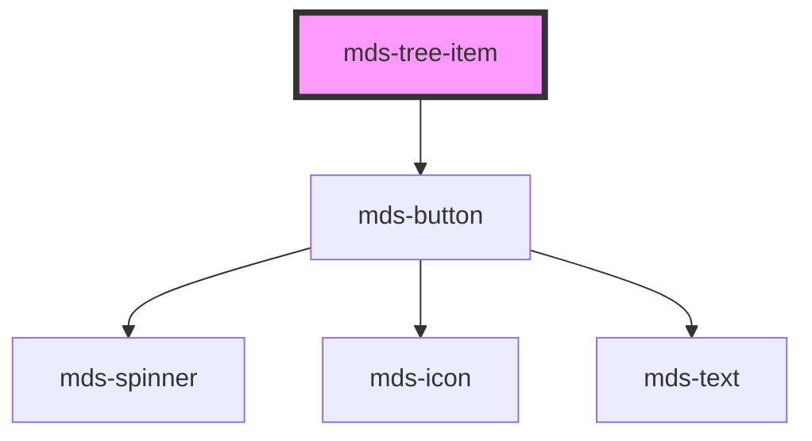

# mds-tree-item

<!-- Auto Generated Below -->

## Usage

### 1. Description

The `<mds-tree-item>` web component is the node primitive of the Magma Design System tree view: it represents a single labeled, expandable/collapsible entry inside an [`<mds-tree>`](../../mds-tree) and is also the recursive container for its own descendants. It replaces the role of an `<li>` within a nested disclosure list.

#### Semantic Behavior

- **Compound child only**: It must be a direct slot child of `<mds-tree>` (first-level nodes) or of another `<mds-tree-item>` (nested nodes). It is not used standalone, and the default slot is reserved for further `<mds-tree-item>` children - not arbitrary content.
- **Parent-driven defaults**: The parent `<mds-tree>` writes `toggle`, `truncate`, `actions`, `depth` and `expanded` onto its descendant items, so these props are usually orchestrated by the tree rather than set per-item. First-level items receive `depth = 0`.
- **Self-managed expansion**: Clicking the toggle or label flips `expanded`, swaps the toggle icon, and animates the children container; on collapse it emits `mdsTreeItemCollapse`.
- **Asynchronous expansion**: When `async` is set, the first expand click does not open immediately - it shows a spinner and emits `mdsTreeItemExpand` so the host can lazy-load children, then calls the public `expand()` method to finalize opening.
- **Bubbled events**: `mdsTreeItemExpand` and `mdsTreeItemCollapse` both carry `{ element }` (the host item) so the tree or application can react to node lifecycle.
- **Leaf vs. branch**: It detects whether it contains nested items and whether it has slotted actions, adjusting the connector/branch rendering and actions visibility accordingly.
- **Public method**: `expand()` opens the node and clears the awaiting state (used to resolve async loads).

#### Properties & Visual Configurations

- **`toggle`**: Picks the disclosure affordance - `chevron` (default arrow) or `folder` (closed/open folder icons that swap with `expanded`). Normally inherited from the parent tree for visual consistency.
- **`actions`**: Controls when slotted `action` controls appear - `auto` reveals them on hover, `visible` keeps them always shown. Place those controls in the named `action` slot.
- **`async`**: Enable when a node's children are loaded on demand; pair it with a listener on `mdsTreeItemExpand` and a call to `expand()` once data is ready.
- **`expanded`**: Mutable open/closed state; set it directly to pre-open a node, but expect the parent tree to override it when the whole tree expands or collapses.
- **`truncate`**: Governs label overflow (`word`, `all`, `none`); `all` enables multi-line clamping. Usually inherited from the tree.
- **`icon`**: Optional leading icon rendered inside the label button, independent of the toggle affordance.
- **`depth`**: Internal/parent-assigned; drives branch-line decoration and should not normally be set by consumers.

## Properties

| Property   | Attribute  | Description                                                              | Type                                     | Default     |
| ---------- | ---------- | ------------------------------------------------------------------------ | ---------------------------------------- | ----------- |
| `actions`  | `actions`  | Show actions on the tree item on hover or by default.                    | `"auto" \| "visible" \| undefined`       | `undefined` |
| `async`    | `async`    | Specifies the tree should be opened asynchronously when after the click. | `boolean \| undefined`                   | `undefined` |
| `depth`    | `depth`    |                                                                          | `number \| undefined`                    | `undefined` |
| `expanded` | `expanded` | Specifies if the tree is expanded.                                       | `boolean \| undefined`                   | `undefined` |
| `icon`     | `icon`     | The icon displayed in the button                                         | `string \| undefined`                    | `undefined` |
| `label`    | `label`    | Specifies the label of the tree item                                     | `string`                                 | `undefined` |
| `toggle`   | `toggle`   | Specifies the icon of the element                                        | `"chevron" \| "folder" \| undefined`     | `undefined` |
| `truncate` | `truncate` | Truncate the text of the element on one single line.                     | `"all" \| "none" \| "word" \| undefined` | `'word'`    |

## Events

| Event                 | Description                                             | Type                                  |
| --------------------- | ------------------------------------------------------- | ------------------------------------- |
| `mdsTreeItemCollapse` | Emits when the component attribute selected is changed  | `CustomEvent<MdsTreeItemEventDetail>` |
| `mdsTreeItemExpand`   | Emits when the component expand it's children container | `CustomEvent<MdsTreeItemEventDetail>` |

## Methods

### `expand() => Promise<void>`

#### Returns

Type: `Promise<void>`

### `updateLang() => Promise<void>`

#### Returns

Type: `Promise<void>`

## Slots

| Slot        | Description                                                               |
| ----------- | ------------------------------------------------------------------------- |
| `"action"`  | Add `mds-button`, `mds-icon` or other types component and HTML element/s. |
| `"default"` | Add `mds-tree-item` element/s.                                            |

## Shadow Parts

| Part                  | Description                                          |
| --------------------- | ---------------------------------------------------- |
| `"actions-container"` | Selects the wrapper of the container of the actions. |
| `"actions-list"`      | Selects the container of the actions.                |

## CSS Custom Properties

| Name                                                             | Description                                                 |
| ---------------------------------------------------------------- | ----------------------------------------------------------- |
| `--mds-tree-item-actions-border-radius`                          | Inherits the border-radius used for tree action containers. |
| `--mds-tree-item-actions-gap`                                    | Spacing between tree item action elements.                  |
| `--mds-tree-item-branch-border-color`                            | The border color of the branch connector for the item.      |
| `--mds-tree-item-branch-border-radius`                           | The border-radius applied to the branch connector.          |
| `--mds-tree-item-branch-border-size`                             | The thickness of the branch connector line.                 |
| `--mds-tree-item-branch-dot-default-color`                       | Default color of the branch dot indicator.                  |
| `--mds-tree-item-branch-dot-expanded-color`                      | Color of the branch dot when expanded.                      |
| `--mds-tree-item-label-default-background`                       | Background color of the label in default state.             |
| `--mds-tree-item-label-hover-background`                         | Background color of the label in hover state.               |
| `--mds-tree-item-label-icon-default-color`                       | Default icon color inside the label.                        |
| `--mds-tree-item-label-icon-hover-color`                         | Icon color inside the label when hovering.                  |
| `--mds-tree-item-line-clamp`                                     | Defines the number of lines before text is truncated.       |
| `--mds-tree-item-toggle-gap`                                     | Spacing between the label and the toggle control.           |
| `--mds-tree-item-toggle-icon-async-background`                   | Background color for async-loading toggle icons.            |
| `--mds-tree-item-toggle-icon-async-color`                        | Icon color for async-loading toggles.                       |
| `--mds-tree-item-toggle-icon-chevron-default-background`         | Background for the default chevron toggle.                  |
| `--mds-tree-item-toggle-icon-chevron-default-color`              | Icon color for the default chevron toggle.                  |
| `--mds-tree-item-toggle-icon-chevron-expanded-background`        | Background for the expanded chevron toggle.                 |
| `--mds-tree-item-toggle-icon-chevron-expanded-color`             | Icon color for the expanded chevron toggle.                 |
| `--mds-tree-item-toggle-icon-folder-default-background`          | Background for the default folder toggle.                   |
| `--mds-tree-item-toggle-icon-folder-default-color`               | Icon color for the default folder toggle.                   |
| `--mds-tree-item-toggle-icon-folder-expanded-background`         | Background for the expanded folder toggle.                  |
| `--mds-tree-item-toggle-icon-folder-expanded-color`              | Icon color for the expanded folder toggle.                  |
| `--mds-tree-item-toggle-icon-position-right-default-background`  | Background for right-positioned toggle in default state.    |
| `--mds-tree-item-toggle-icon-position-right-default-color`       | Icon color for right-positioned toggle in default state.    |
| `--mds-tree-item-toggle-icon-position-right-expanded-background` | Background for right-positioned toggle in expanded state.   |
| `--mds-tree-item-toggle-icon-position-right-expanded-color`      | Icon color for right-positioned toggle in expanded state.   |
| `--mds-tree-item-toggle-size`                                    | Size of the toggle control.                                 |
| `--mds-tree-item-transition-duration`                            | Transition duration for tree item animation.                |
| `--mds-tree-item-transition-timing-function`                     | Transition easing function for tree item animation.         |

## Dependencies

### Depends on

- [mds-button](../mds-button)

### Graph

----------------------------------------------

Built with love @ [Gruppo Maggioli](https://www.maggioli.com) from [R&D Department](https://www.maggioli.com/it-it/chi-siamo/ricerca-sviluppo)
