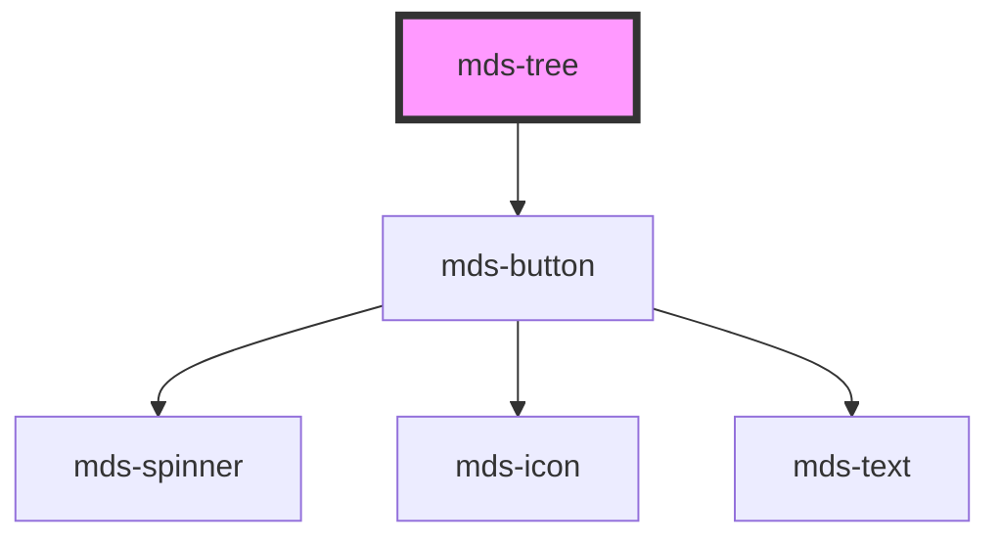

# mds-tree

<!-- Auto Generated Below -->

## Properties

| Property     | Attribute    | Description                                                                                       | Type                                | Default      |
| ------------ | ------------ | ------------------------------------------------------------------------------------------------- | ----------------------------------- | ------------ |
| `appearance` | `appearance` | Specifies the selector of the target element, this attribute is used with `querySelector` method. | `"curved" \| "mixed" \| "straight"` | `'straight'` |
| `depth`      | `depth`      | Specifies the selector of the target element, this attribute is used with `querySelector` method. | `"left" \| "right"`                 | `'left'`     |
| `heiarchy`   | `heiarchy`   | Specifies the selector of the target element, this attribute is used with `querySelector` method. | `boolean`                           | `undefined`  |
| `label`      | `label`      | Specifies the selector of the target element, this attribute is used with `querySelector` method. | `string`                            | `undefined`  |

## Dependencies

### Depends on

- [mds-button](../mds-button)

### Graph

----------------------------------------------

Built with love @ [Gruppo Maggioli](https://www.maggioli.com) from [R&D Department](https://www.maggioli.com/it-it/chi-siamo/ricerca-sviluppo)
