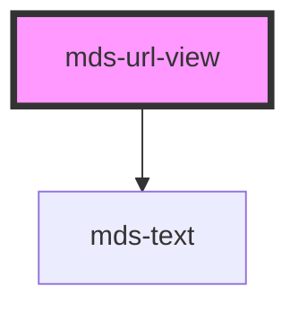

# mds-url-view

<!-- Auto Generated Below -->

## Properties

| Property              | Attribute | Description                                                                                                                | Type                | Default     |
| --------------------- | --------- | -------------------------------------------------------------------------------------------------------------------------- | ------------------- | ----------- |
| `domain` _(required)_ | `domain`  | Specifies if domain is visible on header                                                                                   | `boolean`           | `undefined` |
| `loading`             | `loading` | Specifies whether a browser should load an iframe immediately or to defer loading of images until some conditions are met. | `"eager" \| "lazy"` | `'lazy'`    |
| `src` _(required)_    | `src`     | Specifies the URL to the web page                                                                                          | `string`            | `undefined` |

## Events

| Event   | Description                       | Type                |
| ------- | --------------------------------- | ------------------- |
| `close` | Emits when the url view is closed | `CustomEvent<void>` |

## CSS Custom Properties

| Name                        | Description                                |
| --------------------------- | ------------------------------------------ |
| `--mds-url-view-background` | Sets the background-color of the component |
| `--mds-url-view-color`      | Sets the text color of the component       |
| `--mds-url-view-radius`     | Sets the border-radius of the component    |
| `--mds-url-view-shadow`     | Sets the box-shadow of the component       |

## Dependencies

### Depends on

- [mds-text](../mds-text)

### Graph

----------------------------------------------

Built with love @ **Maggioli Informatica / R&D Department**
