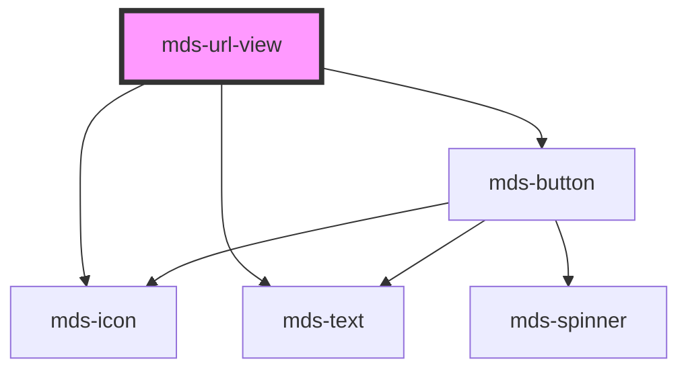

# mds-url-view


This is a web-component from Maggioli Design System [Magma](https://magma.maggiolicloud.it), built with StencilJS, TypeScript, Storybook. It's based on the web-component standard and it's designed to be agnostic from the JavaScript framework you are using.

<!-- Auto Generated Below -->


## Usage

### 1. Description

The `<mds-url-view>` web component renders an embedded preview of an external web page inside a framed browser-like window, wrapping a native `<iframe>` with a titled header, an identifying icon, and a dismiss control. It is the Magma way to surface remote content (typically inside a `mds-modal`) without hand-building chrome around the raw iframe.

#### Semantic Behavior

- **Iframe preview**: The required `src` is loaded into an internal `<iframe>`; the component is purely a presentational frame and does not proxy or sandbox the embedded document beyond the browser defaults.
- **Domain labelling**: When no explicit `label` is provided, the header title falls back to the page's hostname (with a leading `www.` stripped), derived from `src`.
- **Close action**: The header dismiss button emits the `mdsUrlViewClose` event and, when the component is nested inside a `mds-modal`, automatically closes that ancestor modal.
- **Keyboard activation**: The close control can be triggered by keyboard the same way as a pointer click.
- **Localization**: Header tooltip and ARIA strings are resolved in the active language (el / en / es / it).

#### Properties & Visual Configurations

- **`src`** is the only required prop and drives everything else - the iframe source, the fallback header title, and the ARIA descriptions.
- **`label`** overrides the auto-derived hostname shown in the header when a friendlier title is wanted.
- **`icon`** is an SVG filename slug from the Magma icon library shown at the left of the header; it defaults to a generic "explore" glyph when omitted.
- **`loading`** controls iframe fetch timing: `'lazy'` (the default) defers loading until the frame approaches the viewport, while `'eager'` requests the content immediately.

This component does not expose the shared `variant` / `tone` ladders ([`projects/stencil/SPEC.md`](../../../../SPEC.md#tone-and-variant-system)) on its own host; those props are applied internally to the child `mds-button` close control.


### 2. Pattern

Correct and idiomatic ways to use the `<mds-url-view>` component, ordered from most common to most specialized. Patterns assume a working knowledge of the conventions documented in [`docs/COMPONENTS.md`](../../../../../../docs/COMPONENTS.md) and the generic stencil rules in [`projects/stencil/SPEC.md`](../../../../SPEC.md).

#### Minimal Embed Inside a Modal

The most common use: pass only the required `src` and place the component in the `window` slot of [`mds-modal`](../../mds-modal). The header title falls back to the hostname extracted from `src`.

```html
<mds-modal id="modal-anteprima" position="center" opened>
  <mds-url-view
    slot="window"
    class="max-w-screen-tablet w-full"
    src="https://www.comune.bologna.it/"
  ></mds-url-view>
</mds-modal>
```

#### Custom Header Label

Override the auto-derived hostname with a human-readable title via `label`. Use this when the URL is not self-describing or when the UI language differs from the domain name.

```html
<mds-modal id="modal-modulo" position="center" opened>
  <mds-url-view
    slot="window"
    class="max-w-screen-tablet w-full"
    src="https://forms.example.com/richiesta-certificato"
    label="Modulo di richiesta certificato"
  ></mds-url-view>
</mds-modal>
```

#### Custom Header Icon

Provide `icon` with an icon slug to replace the default "explore" glyph with a context-appropriate symbol.

```html
<mds-modal id="modal-libro" position="center" opened>
  <mds-url-view
    slot="window"
    class="max-w-screen-tablet w-full"
    src="https://books.example.com/catalogo"
    label="Catalogo libri"
    icon="mgg/google-book-large"
  ></mds-url-view>
</mds-modal>
```

#### Eager Loading

Set `loading="eager"` when the content should start fetching immediately - for example, when the modal is already open on page load and the iframe is immediately visible.

```html
<mds-modal position="center" opened>
  <mds-url-view
    slot="window"
    src="https://dashboard.example.com/"
    label="Dashboard"
    loading="eager"
  ></mds-url-view>
</mds-modal>
```

#### Reacting to the Close Event

Listen for `mdsUrlViewClose` to update application state when the user clicks the dismiss control. When the component is inside `mds-modal` the ancestor modal is also closed automatically, but you may still need to sync your own state.

```html
<mds-modal id="modal-url" position="center" opened>
  <mds-url-view
    id="url-view"
    slot="window"
    src="https://servizi.example.it/portale"
    label="Portale servizi"
  ></mds-url-view>
</mds-modal>

<script>
  document.querySelector('#url-view').addEventListener('mdsUrlViewClose', () => {
    // aggiorna lo stato dell'applicazione
    appState.urlViewOpen = false;
  });
</script>
```

#### Styling Customization

Style the component only through its documented `--mds-url-view-*` CSS custom properties. Set them on the host or on a parent selector; use Magma color tokens via `rgb(var(--<token>))` so dark mode and high-contrast modes keep working.

```css
.anteprima-documento mds-url-view {
  --mds-url-view-background: rgb(var(--tone-neutral-09));
  --mds-url-view-color: rgb(var(--tone-neutral-01));
  --mds-url-view-radius: var(--radius-lg);
  --mds-url-view-shadow: var(--shadow-xl);
  --mds-url-view-header-shadow: var(--shadow-md-sharp);
}
```


### 3. Antipattern

Common incorrect uses of `<mds-url-view>`. Each entry pairs the wrong form with the right one and a one-line reason. System-wide rules (boolean-as-string, shadow piercing, Tailwind color utilities, raw native event listening) live in [`docs/COMPONENTS.md`](../../../../../../docs/COMPONENTS.md#system-level-anti-patterns) - they apply here too but are not repeated.

#### Do Not Use a Raw `<iframe>` When Magma Chrome Is Needed

Reaching for a bare `<iframe>` skips the header, dismiss control, accessibility labels, keyboard handling, and modal integration that `<mds-url-view>` provides. Use the component instead.

```html
<!-- 🚫 INCORRECT -->
<mds-modal position="center" opened>
  <iframe slot="window" src="https://servizi.example.it/" style="width:100%;height:80vh;"></iframe>
</mds-modal>

<!-- ✅ CORRECT -->
<mds-modal position="center" opened>
  <mds-url-view
    slot="window"
    class="max-w-screen-tablet w-full"
    src="https://servizi.example.it/"
    label="Portale servizi"
  ></mds-url-view>
</mds-modal>
```

#### Do Not Omit `src`

`src` is the only required prop. Omitting it or passing an empty string throws a runtime URL parse error when the component attempts to derive the hostname.

```html
<!-- 🚫 INCORRECT -->
<mds-url-view slot="window"></mds-url-view>

<!-- ✅ CORRECT -->
<mds-url-view slot="window" src="https://servizi.example.it/"></mds-url-view>
```

#### Do Not Use Outside `mds-modal` Without an Explicit Close Handler

`<mds-url-view>` auto-closes the nearest `mds-modal` ancestor on dismiss. Used outside a modal, the close button fires `mdsUrlViewClose` but nothing hides the component - you must listen for the event and handle visibility yourself.

```html
<!-- 🚫 INCORRECT - dismiss button fires but nothing hides the component -->
<mds-url-view src="https://servizi.example.it/" label="Portale"></mds-url-view>

<!-- ✅ CORRECT - listen and hide manually when used standalone -->
<div id="url-wrapper">
  <mds-url-view id="url-view" src="https://servizi.example.it/" label="Portale"></mds-url-view>
</div>
<script>
  document.querySelector('#url-view').addEventListener('mdsUrlViewClose', () => {
    document.querySelector('#url-wrapper').hidden = true;
  });
</script>
```

#### Do Not Pierce the Shadow DOM to Style Internals

The supported customization surface is the five `--mds-url-view-*` CSS custom properties. Targeting shadow internals via `::part()` on undocumented parts, `>>>`, or class-name hacks couples your code to the implementation and will break on minor releases.

```css
/* 🚫 INCORRECT */
mds-url-view >>> .header {
  background: navy;
}
mds-url-view >>> .iframe {
  border: 2px solid red;
}

/* ✅ CORRECT */
mds-url-view {
  --mds-url-view-background: rgb(var(--variant-primary-09));
  --mds-url-view-color: rgb(var(--variant-primary-02));
  --mds-url-view-header-shadow: var(--shadow-md-sharp);
}
```

#### Do Not Pass a Relative URL to `src`

The component calls `new URL(src)` to extract the hostname for the fallback title and ARIA labels. A relative path throws a `TypeError` at render time. Always pass an absolute URL.

```html
<!-- 🚫 INCORRECT -->
<mds-url-view slot="window" src="/portale/servizi"></mds-url-view>

<!-- ✅ CORRECT -->
<mds-url-view slot="window" src="https://servizi.example.it/portale"></mds-url-view>
```

#### Do Not Use `loading="false"` to Disable Lazy Loading

`loading` accepts the string values `"lazy"` and `"eager"`, not booleans. Setting `loading="false"` is not a valid value and will not switch the iframe to eager loading.

```html
<!-- 🚫 INCORRECT -->
<mds-url-view slot="window" src="https://example.com/" loading="false"></mds-url-view>

<!-- ✅ CORRECT -->
<mds-url-view slot="window" src="https://example.com/" loading="eager"></mds-url-view>
```


## Properties

| Property           | Attribute | Description                                                                                                                | Type                             | Default     |
| ------------------ | --------- | -------------------------------------------------------------------------------------------------------------------------- | -------------------------------- | ----------- |
| `icon`             | `icon`    | Specifies if domain is visible on header                                                                                   | `string \| undefined`            | `undefined` |
| `label`            | `label`   | Specifies if the window has a label                                                                                        | `string \| undefined`            | `undefined` |
| `loading`          | `loading` | Specifies whether a browser should load an iframe immediately or to defer loading of images until some conditions are met. | `"eager" \| "lazy" \| undefined` | `'lazy'`    |
| `src` _(required)_ | `src`     | Specifies the URL to the web page                                                                                          | `string`                         | `undefined` |


## Events

| Event             | Description                            | Type                |
| ----------------- | -------------------------------------- | ------------------- |
| `mdsUrlViewClose` | Emits when the close button is clicked | `CustomEvent<void>` |


## Methods

### `updateLang() => Promise<void>`

Updates the component's texts to the locale currently set on the host element.

#### Returns

Type: `Promise<void>`


## CSS Custom Properties

| Name                           | Description                                            |
| ------------------------------ | ------------------------------------------------------ |
| `--mds-url-view-background`    | Background color of the URL view container.            |
| `--mds-url-view-color`         | Text color used inside the URL view.                   |
| `--mds-url-view-header-shadow` | Box-shadow applied to the header area of the URL view. |
| `--mds-url-view-radius`        | Border-radius applied to the URL view container.       |
| `--mds-url-view-shadow`        | Box-shadow applied to the entire URL view container.   |


## Dependencies

### Depends on

- [mds-icon](../mds-icon)
- [mds-text](../mds-text)
- [mds-button](../mds-button)

### Graph


----------------------------------------------

Built with love @ [Gruppo Maggioli](https://www.maggioli.com) from [R&D Department](https://www.maggioli.com/it-it/chi-siamo/ricerca-sviluppo)
