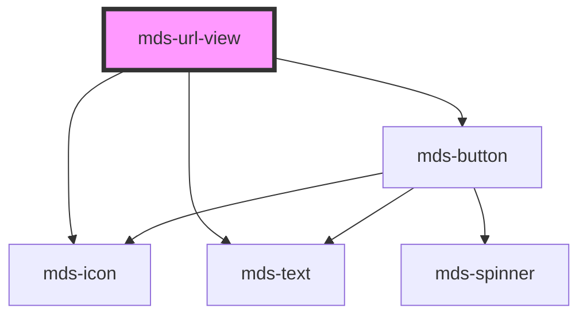

# mds-url-view

This is a web-component from Maggioli Design System [Magma](https://magma.maggiolicloud.it), built with StencilJS, TypeScript, Storybook. It's based on the web-component standard and it's designed to be agnostic from the JavaScript framework you are using.

<!-- Auto Generated Below -->

## Usage

### 1. Description

The `<mds-url-view>` web component renders an embedded preview of an external web page inside a framed browser-like window, wrapping a native `<iframe>` with a titled header, an identifying icon, and a dismiss control. It is the Magma way to surface remote content (typically inside a `mds-modal`) without hand-building chrome around the raw iframe.

#### Semantic Behavior

- **Iframe preview**: The required `src` is loaded into an internal `<iframe>`; the component is purely a presentational frame and does not proxy or sandbox the embedded document beyond the browser defaults.
- **Domain labelling**: When no explicit `label` is provided, the header title falls back to the page's hostname (with a leading `www.` stripped), derived from `src`.
- **Close action**: The header dismiss button emits the `mdsUrlViewClose` event and, when the component is nested inside a `mds-modal`, automatically closes that ancestor modal.
- **Keyboard activation**: The close control can be triggered by keyboard the same way as a pointer click.
- **Localization**: Header tooltip and ARIA strings are resolved in the active language (el / en / es / it).

#### Properties & Visual Configurations

- **`src`** is the only required prop and drives everything else - the iframe source, the fallback header title, and the ARIA descriptions.
- **`label`** overrides the auto-derived hostname shown in the header when a friendlier title is wanted.
- **`icon`** is an SVG filename slug from the Magma icon library shown at the left of the header; it defaults to a generic "explore" glyph when omitted.
- **`loading`** controls iframe fetch timing: `'lazy'` (the default) defers loading until the frame approaches the viewport, while `'eager'` requests the content immediately.

This component does not expose the shared `variant` / `tone` ladders ([`projects/stencil/SPEC.md`](../../../../SPEC.md#tone-and-variant-system)) on its own host; those props are applied internally to the child `mds-button` close control.

## Properties

| Property           | Attribute | Description                                                                                                                | Type                             | Default     |
| ------------------ | --------- | -------------------------------------------------------------------------------------------------------------------------- | -------------------------------- | ----------- |
| `icon`             | `icon`    | Specifies if domain is visible on header                                                                                   | `string \| undefined`            | `undefined` |
| `label`            | `label`   | Specifies if the window has a label                                                                                        | `string \| undefined`            | `undefined` |
| `loading`          | `loading` | Specifies whether a browser should load an iframe immediately or to defer loading of images until some conditions are met. | `"eager" \| "lazy" \| undefined` | `'lazy'`    |
| `src` _(required)_ | `src`     | Specifies the URL to the web page                                                                                          | `string`                         | `undefined` |

## Events

| Event             | Description                            | Type                |
| ----------------- | -------------------------------------- | ------------------- |
| `mdsUrlViewClose` | Emits when the close button is clicked | `CustomEvent<void>` |

## Methods

### `updateLang() => Promise<void>`

#### Returns

Type: `Promise<void>`

## CSS Custom Properties

| Name                           | Description                                            |
| ------------------------------ | ------------------------------------------------------ |
| `--mds-url-view-background`    | Background color of the URL view container.            |
| `--mds-url-view-color`         | Text color used inside the URL view.                   |
| `--mds-url-view-header-shadow` | Box-shadow applied to the header area of the URL view. |
| `--mds-url-view-radius`        | Border-radius applied to the URL view container.       |
| `--mds-url-view-shadow`        | Box-shadow applied to the entire URL view container.   |

## Dependencies

### Depends on

- [mds-icon](../mds-icon)
- [mds-text](../mds-text)
- [mds-button](../mds-button)

### Graph

----------------------------------------------

Built with love @ [Gruppo Maggioli](https://www.maggioli.com) from [R&D Department](https://www.maggioli.com/it-it/chi-siamo/ricerca-sviluppo)
