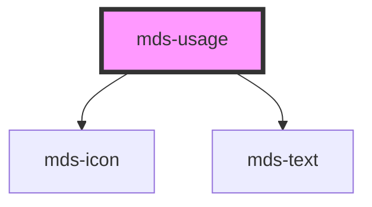

# mds-usage

This is a web-component from Maggioli Design System [Magma](https://magma.maggiolicloud.it), built with StencilJS, TypeScript, Storybook. It's based on the web-component standard and it's designed to be agnostic from the JavaScript framework you are using.

<!-- Auto Generated Below -->

## Usage

### 1. Description

The `<mds-usage>` web component is a documentation-oriented annotation block of the Magma Design System used to frame example content as a recommendation, a warning, or an informational note. It wraps slotted content in a labelled, status-colored container and has no native HTML primitive equivalent - it is a presentational guidance device, typically used inside design-system docs and Storybook.

#### Semantic Behavior

- **Status semantics via `variant`**: The chosen `variant` drives the border and header color from the shared status palette (success / info / error / warning), so the container reads as the matching guidance category.
- **Content role mapping**: The content region conveys an allowed-vs-disallowed nature to assistive technology - insertion for the `'do'` and `'info'` variants, deletion for `'dont'` and `'warn'`.
- **Localized header label**: When `alias` is not provided, the header text is resolved from the bundled locale dictionary (el / en / es / it) keyed by `variant`, so the label follows the document language.
- **Default slot is content**: The default (unnamed) slot accepts a text string, HTML elements, or other components - it is the body of the usage block, not the label.

#### Properties & Visual Configurations

`variant` is the primary configuration prop. Unlike most Magma components, this is NOT the shared variant/tone ladder defined in [`projects/stencil/SPEC.md`](../../../../SPEC.md#tone-and-variant-system); it is a component-specific guidance category:

- **`variant="do"`**: marks recommended / allowed usage (success styling, insertion role).
- **`variant="dont"`**: marks discouraged / disallowed usage (error styling, deletion role).
- **`variant="info"`**: neutral informational note (info styling, insertion role); this is the default.
- **`variant="warn"`**: cautionary note (warning styling, deletion role).

#### Other behavioral props

- **`alias`** overrides the auto-generated, localized header phrase with a custom string when the default category label is not specific enough for the example being shown.

## Properties

| Property  | Attribute | Description                                                         | Type                                 | Default     |
| --------- | --------- | ------------------------------------------------------------------- | ------------------------------------ | ----------- |
| `alias`   | `alias`   | Specifies the alias of the usage phrase on the top of the component | `string \| undefined`                | `undefined` |
| `variant` | `variant` | Specifies the delay when the tooltip will trigger                   | `"do" \| "dont" \| "info" \| "warn"` | `'info'`    |

## Methods

### `updateLang() => Promise<void>`

#### Returns

Type: `Promise<void>`

## Slots

| Slot        | Description                                                      |
| ----------- | ---------------------------------------------------------------- |
| `"default"` | Add `text string`, `HTML elements` or `components` to this slot. |

## Shadow Parts

| Part       | Description |
| ---------- | ----------- |
| `"header"` |             |
| `"icon"`   |             |
| `"label"`  |             |

## CSS Custom Properties

| Name                            | Description                                                   |
| ------------------------------- | ------------------------------------------------------------- |
| `--mds-usage-border-color`      | The border-color applied to the usage container or indicator. |
| `--mds-usage-header-background` | The background-color of the usage header.                     |
| `--mds-usage-header-color`      | The text/icon color of the usage header.                      |

## Dependencies

### Depends on

- [mds-icon](../mds-icon)
- [mds-text](../mds-text)

### Graph

----------------------------------------------

Built with love @ [Gruppo Maggioli](https://www.maggioli.com) from [R&D Department](https://www.maggioli.com/it-it/chi-siamo/ricerca-sviluppo)
