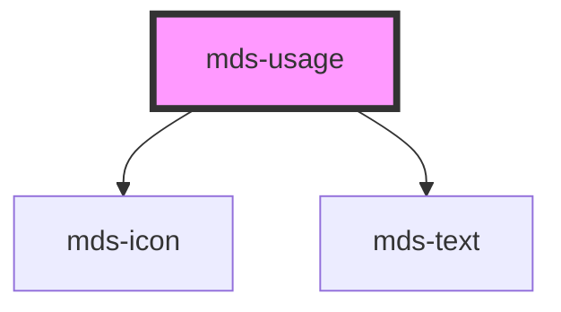

# mds-usage

This is a web-component from Maggioli Design System [Magma](https://magma.maggiolicloud.it), built with StencilJS, TypeScript, Storybook. It's based on the web-component standard and it's designed to be agnostic from the JavaScirpt framework you are using.

<!-- Auto Generated Below -->

## Properties

| Property  | Attribute | Description                                                         | Type                                 | Default     |
| --------- | --------- | ------------------------------------------------------------------- | ------------------------------------ | ----------- |
| `alias`   | `alias`   | Specifies the alias of the usage phrase on the top of the component | `string \| undefined`                | `undefined` |
| `variant` | `variant` | Specifies the delay when the tooltip will trigger                   | `"do" \| "dont" \| "info" \| "warn"` | `'info'`    |

## Slots

| Slot        | Description                                                      |
| ----------- | ---------------------------------------------------------------- |
| `"default"` | Add `text string`, `HTML elements` or `components` to this slot. |

## Dependencies

### Depends on

- [mds-icon](../mds-icon)
- [mds-text](../mds-text)

### Graph

----------------------------------------------

Built with love @ [Gruppo Maggioli](https://www.maggioli.com) from [R&D Department](https://www.maggioli.com/it-it/chi-siamo/ricerca-sviluppo)
