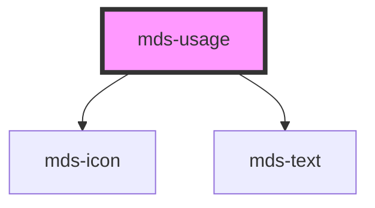

# mds-usage

<!-- Auto Generated Below -->

## Properties

| Property  | Attribute | Description                                                         | Type                                 | Default     |
| --------- | --------- | ------------------------------------------------------------------- | ------------------------------------ | ----------- |
| `alias`   | `alias`   | Specifies the alias of the usage phrase on the top of the component | `string \| undefined`                | `undefined` |
| `variant` | `variant` | Specifies the delay when the tooltip will trigger                   | `"do" \| "dont" \| "info" \| "warn"` | `'info'`    |

## Slots

| Slot        | Description                                                      |
| ----------- | ---------------------------------------------------------------- |
| `"default"` | Add `text string`, `HTML elements` or `components` to this slot. |

## CSS Custom Properties

| Name             | Description                                   |
| ---------------- | --------------------------------------------- |
| `--background`   | Sets the background-color of the component    |
| `--border-width` | Sets the colored border-size of the component |

## Dependencies

### Depends on

- [mds-icon](../mds-icon)
- [mds-text](../mds-text)

### Graph

----------------------------------------------

Built with love @ **Maggioli Informatica / R&D Department**
