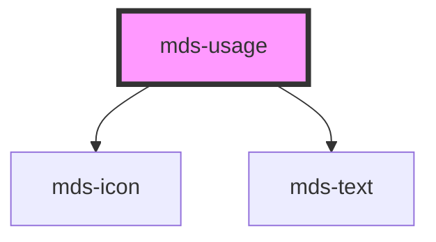

# mds-usage


This is a web-component from Maggioli Design System [Magma](https://magma.maggiolicloud.it), built with StencilJS, TypeScript, Storybook. It's based on the web-component standard and it's designed to be agnostic from the JavaScript framework you are using.

<!-- Auto Generated Below -->


## Usage

### 1. Description

The `<mds-usage>` web component is a documentation-oriented annotation block of the Magma Design System used to frame example content as a recommendation, a warning, or an informational note. It wraps slotted content in a labelled, status-colored container and has no native HTML primitive equivalent - it is a presentational guidance device, typically used inside design-system docs and Storybook.

#### Semantic Behavior

- **Status semantics via `variant`**: The chosen `variant` drives the border and header color from the shared status palette (success / info / error / warning), so the container reads as the matching guidance category.
- **Content role mapping**: The content region conveys an allowed-vs-disallowed nature to assistive technology - insertion for the `'do'` and `'info'` variants, deletion for `'dont'` and `'warn'`.
- **Localized header label**: When `alias` is not provided, the header text is resolved from the bundled locale dictionary (el / en / es / it) keyed by `variant`, so the label follows the document language.
- **Default slot is content**: The default (unnamed) slot accepts a text string, HTML elements, or other components - it is the body of the usage block, not the label.

#### Properties & Visual Configurations

`variant` is the primary configuration prop. Unlike most Magma components, this is NOT the shared variant/tone ladder defined in [`projects/stencil/SPEC.md`](../../../../SPEC.md#tone-and-variant-system); it is a component-specific guidance category:

- **`variant="do"`**: marks recommended / allowed usage (success styling, insertion role).
- **`variant="dont"`**: marks discouraged / disallowed usage (error styling, deletion role).
- **`variant="info"`**: neutral informational note (info styling, insertion role); this is the default.
- **`variant="warn"`**: cautionary note (warning styling, deletion role).

#### Other behavioral props

- **`alias`** overrides the auto-generated, localized header phrase with a custom string when the default category label is not specific enough for the example being shown.


### 2. Pattern

Correct and idiomatic ways to use the `<mds-usage>` component, ordered from most common to most specialized. Patterns assume a working knowledge of the conventions documented in [`docs/COMPONENTS.md`](../../../../../../docs/COMPONENTS.md) and the generic stencil rules in [`projects/stencil/SPEC.md`](../../../../SPEC.md).

#### Default Informational Note

The simplest form. Omit `variant` to get the `info` default - a neutral, blue-tinted container that draws attention to a usage note without implying correctness or incorrectness.

```html
<mds-usage>
  <mds-text>
    Utilizzare sempre il colore primario del tema per le azioni principali.
  </mds-text>
</mds-usage>
```

#### Recommended Pattern (`variant="do"`)

Use `variant="do"` to mark a component usage or design pattern as explicitly recommended. The container adopts success styling and the content region carries `role="insertion"` for assistive technology.

```html
<mds-usage variant="do">
  <mds-button label="Salva" variant="primary" tone="strong"></mds-button>
</mds-usage>
```

#### Discouraged Pattern (`variant="dont"`)

Use `variant="dont"` to mark a usage as explicitly forbidden or inadvisable. The container adopts error styling and the content region carries `role="deletion"`.

```html
<mds-usage variant="dont">
  <button style="background: blue; color: white;">Salva</button>
</mds-usage>
```

#### Cautionary Note (`variant="warn"`)

Use `variant="warn"` when a pattern is not forbidden but requires care - for example when a prop combination is valid but has side effects, or when a rare edge case exists. The container adopts warning styling and carries `role="deletion"`.

```html
<mds-usage variant="warn">
  <mds-text>
    Impostare <code>type="button"</code> su ogni pulsante all'interno di un form
    per evitare invii accidentali.
  </mds-text>
</mds-usage>
```

#### Custom Header Label via `alias`

When the auto-generated, localized header ("Consentito", "Non consentito", etc.) is not specific enough for the context, pass `alias` to replace it with a custom string. The locale dictionary is bypassed entirely.

```html
<mds-usage variant="do" alias="Struttura consigliata">
  <mds-text>Usare mds-card con header, content e footer separati.</mds-text>
</mds-usage>

<mds-usage variant="dont" alias="Struttura da evitare">
  <mds-text>Non annidare mds-card all'interno di un'altra mds-card.</mds-text>
</mds-usage>
```

#### Side-by-Side Do / Dont Pair

Pair a `do` block with a `dont` block to illustrate a correct and an incorrect approach in the same documentation section. No extra wrapper is needed - use a CSS grid or flex container.

```html
<div style="display: grid; grid-template-columns: 1fr 1fr; gap: 1rem;">
  <mds-usage variant="do">
    <mds-button label="Conferma" variant="primary" tone="strong"></mds-button>
  </mds-usage>

  <mds-usage variant="dont">
    <mds-button label="Conferma" tone="strong" style="--mds-button-background: green;"></mds-button>
  </mds-usage>
</div>
```

#### Rich Slotted Content

The default slot accepts any HTML or Magma components. Use this to annotate a fully composed UI fragment rather than a single element.

```html
<mds-usage variant="do" alias="Composizione corretta di mds-card">
  <mds-card>
    <mds-card-header slot="header" label="Titolo scheda"></mds-card-header>
    <mds-card-content slot="content">
      <mds-text>Contenuto principale della scheda.</mds-text>
    </mds-card-content>
    <mds-card-footer slot="footer">
      <mds-button label="Azione" variant="primary"></mds-button>
    </mds-card-footer>
  </mds-card>
</mds-usage>
```

#### CSS Custom Property Overrides

Customize the container appearance through the three documented `--mds-usage-*` CSS custom properties. Set them on the host or a parent selector and use Magma color tokens via `rgb(var(--<token>))` to keep dark mode working.

```css
.docs-callout mds-usage {
  --mds-usage-border-color: rgb(var(--variant-ai-05));
  --mds-usage-header-background: rgb(var(--variant-ai-03));
  --mds-usage-header-color: rgb(var(--tone-neutral));
}
```


### 3. Antipattern

Common incorrect uses of `<mds-usage>`. Each entry pairs the wrong form with the right one and a one-line reason. System-wide rules (boolean-as-string, shadow piercing, Tailwind color utilities, raw native event listening) live in [`docs/COMPONENTS.md`](../../../../../../docs/COMPONENTS.md#system-level-anti-patterns) - they apply here too but are not repeated.

#### Do Not Use `variant` as the Shared Tone/Variant Ladder

`<mds-usage>` does not use the system-wide `variant` ladder (`primary`, `secondary`, `error`, etc.). Its `variant` prop is component-specific (`do`, `dont`, `info`, `warn`). Passing a system variant silently falls back to `info` styling.

```html
<!-- 🚫 INCORRECT -->
<mds-usage variant="error">
  <mds-text>Non consentito.</mds-text>
</mds-usage>

<!-- ✅ CORRECT -->
<mds-usage variant="dont">
  <mds-text>Non consentito.</mds-text>
</mds-usage>
```

#### Do Not Omit the Slot Content

`<mds-usage>` renders a labeled container; without slotted content the block displays only the colored header strip with no body - producing a visually broken annotation. Always provide meaningful content in the default slot.

```html
<!-- 🚫 INCORRECT -->
<mds-usage variant="do"></mds-usage>

<!-- ✅ CORRECT -->
<mds-usage variant="do">
  <mds-text>Usare sempre il colore del tema per i pulsanti primari.</mds-text>
</mds-usage>
```

#### Do Not Put the Label in the Default Slot

The default slot is the body of the block. Placing a heading or label string there makes it look like body text, not a header. Use the `alias` prop to supply a custom header label.

```html
<!-- 🚫 INCORRECT -->
<mds-usage variant="do">
  Struttura consigliata
</mds-usage>

<!-- ✅ CORRECT -->
<mds-usage variant="do" alias="Struttura consigliata">
  <mds-text>Comporre mds-card con i suoi sotto-componenti dedicati.</mds-text>
</mds-usage>
```

#### Do Not Pierce Shadow Parts to Restyle the Header

`::part(header)`, `::part(icon)`, and `::part(label)` are the only documented extension points for shadow internals. Targeting undocumented class names or using `>>>` couples code to implementation details that may change. For color overrides, use the documented `--mds-usage-*` CSS custom properties instead.

```css
/* 🚫 INCORRECT */
mds-usage >>> .header {
  background: purple;
}
mds-usage::part(icon) {
  display: none;
}

/* ✅ CORRECT */
mds-usage {
  --mds-usage-header-background: rgb(var(--variant-ai-03));
  --mds-usage-header-color: rgb(var(--tone-neutral));
}
```

#### Do Not Use `<mds-usage>` as a General-Purpose Card

`<mds-usage>` is a documentation/Storybook annotation primitive - it is not a card, callout, or alert for production UIs. For in-app status messages use [`mds-banner`](../../mds-banner), [`mds-note`](../../mds-note), or [`mds-toast`](../../mds-toast).

```html
<!-- 🚫 INCORRECT - using mds-usage as a production alert -->
<mds-usage variant="warn">
  <mds-text>La sessione sta per scadere.</mds-text>
</mds-usage>

<!-- ✅ CORRECT - use the appropriate production component -->
<mds-banner variant="warning" tone="weak" label="La sessione sta per scadere."></mds-banner>
```


## Properties

| Property  | Attribute | Description                                                         | Type                                 | Default     |
| --------- | --------- | ------------------------------------------------------------------- | ------------------------------------ | ----------- |
| `alias`   | `alias`   | Specifies the alias of the usage phrase on the top of the component | `string \| undefined`                | `undefined` |
| `variant` | `variant` | Specifies the delay when the tooltip will trigger                   | `"do" \| "dont" \| "info" \| "warn"` | `'info'`    |


## Methods

### `updateLang() => Promise<void>`


#### Returns

Type: `Promise<void>`


## Slots

| Slot        | Description                                                      |
| ----------- | ---------------------------------------------------------------- |
| `"default"` | Add `text string`, `HTML elements` or `components` to this slot. |


## Shadow Parts

| Part       | Description |
| ---------- | ----------- |
| `"header"` |             |
| `"icon"`   |             |
| `"label"`  |             |


## CSS Custom Properties

| Name                            | Description                                                   |
| ------------------------------- | ------------------------------------------------------------- |
| `--mds-usage-border-color`      | The border-color applied to the usage container or indicator. |
| `--mds-usage-header-background` | The background-color of the usage header.                     |
| `--mds-usage-header-color`      | The text/icon color of the usage header.                      |


## Dependencies

### Depends on

- [mds-icon](../mds-icon)
- [mds-text](../mds-text)

### Graph


----------------------------------------------

Built with love @ [Gruppo Maggioli](https://www.maggioli.com) from [R&D Department](https://www.maggioli.com/it-it/chi-siamo/ricerca-sviluppo)
